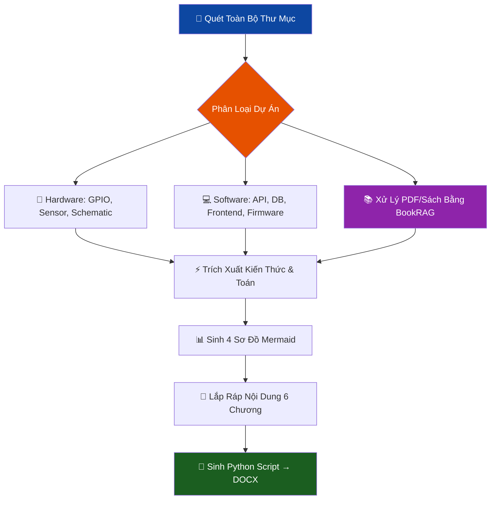

# Phần 1/4: Mục tiêu & Quy trình Quét Sâu (Deep Research)
> 💡 **Chú ý cho AI:** Đây là phần 1 của Skill Báo Cáo. Bạn cần đọc 4 phần để hoạt động chính xác.

# 🎓 Skill: Nghiên Cứu Sâu & Tạo Báo Cáo Luận Văn TDTU — v2.0

> **Version:** 2.0 · **Cập nhật:** 2026-04-20 · **Danh mục:** Phân Tích Sâu & Tài Liệu Học Thuật  
> **Tác giả:** Lê Minh Đạt
> **Mục đích:** Quét 100% source code → Sinh báo cáo đúng chuẩn **MauDATN_2021 TDTU** → Xuất file **DOCX** (KHÔNG PHẢI PDF)

---

## 1. Mục Tiêu (Objective)

Đóng vai **Chuyên gia Báo cáo Luận Văn TDTU**.  
Phân tích chiều sâu toàn bộ dự án (phần cứng + phần mềm), rồi **sinh ra nội dung báo cáo và Python script để tạo file DOCX chuẩn format MauDATN_2021**.

> ⚠️ **QUY TẮC SỐ 1 — BẮT BUỘC (CHIẾN LƯỢC CHỐNG LỖI CỤT CODE / LAZY):**  
> Khi user yêu cầu file docx, bạn sẽ dùng `python-docx` để tạo file `.docx`. Tuy nhiên, vì đoạn Script Template cực kỳ dài (hơn 1000 dòng nằm ở **Phần 3** và **Phần 4**), nếu bạn cố gắng "tự gõ lại" toàn bộ ra khung chat, bạn sẽ bị cạn token và tự động viết tắt (lỗi code ngắn 200 dòng vỡ format).
> **Xử lý:** 
> 1. Nếu bạn có quyền thao tác file local (như Agent Cursor/Windsurf/Antigravity), hãy dùng công cụ lệnh shell ghi text hoặc dán thẳng khối mã nguồn từ Phần 3/4 vào `generator.py` thay vì in ra màn hình.
> 2. Nếu ở Web Chat, hãy yêu cầu: *"Vì thư viện DOCX Engine của đề tài rất dài (>1000 dòng chuẩn TDTU), xin anh vui lòng tải mã nguồn Python Engine đã đính kèm, tôi sẽ chỉ xuất phần code nội dung luận văn (Content Generator) để anh ghép vào phần dưới của file."* Sau đó, CHỈ xuất phần logic `doc.add_heading...`. KHÔNG sinh lại các hàm setup `setup_styles`, `add_toc`...

**Triết lý cốt lõi:**  
*"Không chỉ báo cáo cái gì đã làm — phải chứng minh TẠI SAO lại làm như vậy."*

> 🛑 **KHI BẮT ĐẦU TRUY VẤN:**  
> Bạn MẶC ĐỊNH PHẢI HỎI NGƯỜI DÙNG 2 thông số sau trước khi sinh báo cáo (KHÔNG TỰ Ý ĐOÁN):
> 1. Tên đề tài chính xác để in lên Footer.
> 2. Loại đồ án (ví dụ: "ĐỒ ÁN TỐT NGHIỆP" hay "ĐỒ ÁN TỔNG HỢP") để in lên Header.

---

## 2. Trigger — Khi Nào Kích Hoạt

| Lời nói | Ngữ cảnh | Ưu tiên |
|---|---|---|
| *"viết báo cáo cho thầy"*, *"nộp đồ án"* | Chuẩn bị bảo vệ | 🔴 Cao |
| *"làm file docx luận văn TDTU"* | Cần file Word ngay | 🔴 Cao |
| *"viết theo format MauDATN_2021"* | Format chuẩn đại học | 🔴 Cao |
| *"mổ xẻ dự án, tôi học được gì"* | Rút kinh nghiệm | 🟠 Trung |

> ℹ️ Khác `skill_viet_docs.md`: Nếu user chỉ cần README/chú thích code → dùng `skill_viet_docs`. Nếu cần **file Word nộp thầy** → dùng skill này.

---

## 3. Thư Viện Mẫu TDTU (ĐÃ HỌC TỪ FILE GỐC)

Các file mẫu sau đã được extract về Markdown và lưu tại `c:\code2\skill\templates_md\`:
- `MauDATN_2021.md` — Mẫu chính thức của TDTU (Khoa Điện - Điện Tử)
- `Báo cáo -  BẢN CHÍNH.md` — Báo cáo AMR mẫu thực tế (tiếng Anh)  
- `Báo cáo - Copy-2.md` — Phiên bản phụ

**Khi sinh báo cáo, AI PHẢI đọc các file này trước** để học cách trình bày thực tế.

---

## 4. FORMAT CHUẨN MauDATN_2021 (Học Từ File Gốc)

### 4.1 Cài Đặt Trang (Page Setup) — ĐO ĐƯỢC TỪ FILE GỐC

| Thông số | Giá trị CHÍNH XÁC |
|---|---|
| Khổ giấy | **A4 — 21.0 × 29.7 cm** |
| Lề trên | **3.5 cm** |
| Lề dưới | **3.0 cm** |
| Lề trái | **3.5 cm** |
| Lề phải | **2.0 cm** |
| Số trang | Ở giữa, phía **trên đầu** mỗi trang |
| Hướng giấy | Đứng (Portrait) |

### 4.2 Font & Style — ĐO ĐƯỢC TỪ FILE MauDATN_2021.docm

| Style Word | Font | Cỡ chữ | Định dạng | Ghi chú |
|---|---|---|---|---|
| `Normal` (nội dung chính) | **Times New Roman** | **13pt** | Justify, 1.5 line | Đoạn đầu thụt vào 1 tab |
| `Heading 1` (Chương) | **Times New Roman** | **14pt** | **IN HOA, Bold, Căn giữa** | VD: `CHƯƠNG 1. GIỚI THIỆU ĐỀ TÀI` |
| `Heading 2` (Mục cấp 1) | **Times New Roman** | **13pt** | **Bold** | VD: `1.1 Mục đích thực hiện đề tài` |
| `Heading 3` (Mục cấp 2) | **Times New Roman** | **13pt** | **Bold, Italic** | VD: `1.1.1 Nguyên lý thứ nhất` |
| `TOC TITLE` (Mục lục) | Times New Roman | **16pt** | Căn giữa | MỤC LỤC / CONTENTS |
| `ThesisFigure` (Chú thích hình) | Times New Roman | **12pt** | *Italic, Căn giữa* | Bên **dưới** hình |
| `ThesisTable` (Chú thích bảng) | Times New Roman | **12pt** | *Italic, Căn giữa* | Bên **trên** bảng |
| `Bibliography` (Tài liệu TK) | Times New Roman | **12pt** | Thường | Kiểu APA 6th |
| `Appendix` (Phụ lục) | Times New Roman | — | IN HOA | VD: `PHỤ LỤC A MÃ NGUỒN` |

### 4.3 Quy Tắc Đánh Số — HỌC TỪ MỤC LỤC MẪU

```
CHƯƠNG 1.  TÊN CHƯƠNG (In hoa, Bold, Heading 1)
1.1  Mục cấp 1 (Bold, Heading 2)  
1.1.1  Mục cấp 2 (Bold Italic, Heading 3)
```

> ⚠️ **Quy tắc tiểu mục:** Mỗi nhóm tiểu mục PHẢI có ít nhất 2 tiểu mục (không có 1.1.1 mà không có 1.1.2).

### 4.4 Hình Ảnh & Bảng Biểu

- **Hình vẽ:** Chú thích ở **BÊN DƯỚI**, format: `Hình 3.1: Sơ đồ khối hệ thống` *(ThesisFigure, 12pt, Italic, Căn giữa)*
- **Bảng biểu:** Chú thích ở **BÊN TRÊN**, format: `Bảng 2.1: Danh sách linh kiện` *(ThesisTable, 12pt, Italic, Căn giữa)*
- Đánh số gắn với chương: `Hình 3.1`, `Bảng 3.2` (hình/bảng thứ 1, 2 trong Chương 3)

### 4.5 Trích Dẫn Tài Liệu — Kiểu APA 6th

```
(Tác giả, Năm)  — ví dụ: (Macenski et al., 2021)

Danh mục TLTK:
Macenski, S., et al. (2021). "SLAM Toolbox...". Journal of Open Source Software.
```

---

## 5. Deep Research Pipeline (Quy Trình Quét Sâu)



### Bước 1: Lập Bản Đồ Kiến Thức (Knowledge Map) — ĐỌC THẬT SÂU

> 🔴 **KHÔNG ĐƯỢC VIẾT BẤT CỨ CHỮ NÀO VÀO BÁO CÁO TRƯỚC KHI HOÀN THÀNH BƯỚC NÀY.**  
> Mục tiêu: xây dựng 1 "bộ hồ sơ kỹ thuật" đầy đủ từ code thực tế.

#### 1A. Scan Cấu Trúc Thư Mục
```
list_dir <project_root>          # Xem toàn bộ cây thư mục
list_dir <project_root>/src      # Đào sâu từng sub-folder quan trọng
list_dir <project_root>/firmware
list_dir <project_root>/backend
list_dir <project_root>/frontend
```
**Ghi lại:** Tên thư mục → suy ra kiến trúc (monolith / multi-module / mono-repo / ROS workspace)

#### 1B. Đọc File Cấu Hình (Config & Manifest)
Đọc theo thứ tự ưu tiên — các file này tiết lộ 80% thông tin kỹ thuật:

| File cần đọc | Trích xuất gì |
|---|---|
| `platformio.ini` | Board, framework, lib_deps, upload speed, monitor speed |
| `package.json` / `package-lock.json` | Framework version, dependency tree |
| `requirements.txt` / `pyproject.toml` | Python packages + phiên bản |
| `CMakeLists.txt` / `colcon.meta` | ROS2 package, node names |
| `docker-compose.yml` | Services, ports, volumes, environment vars |
| `.env` / `config.py` | MQTT broker URL, DB connection, API keys pattern |
| `schema.sql` / `prisma.schema` | Table structure, relationships (→ ERD) |
| `Makefile` / `scripts/` | Build pipeline, deployment steps |

#### 1C. Đọc Code Nguồn Cốt Lõi (Source Deep Dive)

**Firmware / Embedded:**
```
view_file main.cpp / main.ino         # setup(), loop(), interrupt handlers
grep_search "void setup" .            # Tìm init sequence
grep_search "analogWrite\|pwmWrite\|ledc" .   # PWM channels, frequency
grep_search "servo.write\|Servo " .   # Servo control, angles
grep_search "Wire.begin\|I2C\|SPI" .  # Communication buses
grep_search "pinMode\|digitalWrite" . # GPIO mapping → Bảng GPIO
grep_search "#define\|const int" .    # Hằng số kỹ thuật (pin numbers, thresholds)
grep_search "PID\|Kp\|Ki\|Kd" .      # PID parameters
grep_search "delay\|millis\|micros" . # Timing logic
```

**Backend / Server:**
```
grep_search "app.get\|app.post\|router\|@app.route" .   # API endpoints
grep_search "mongoose\|prisma\|sequelize\|sqlalchemy" .  # ORM models → schema
grep_search "jwt\|bcrypt\|passport\|authMiddleware" .    # Auth implementation
grep_search "mqtt\|WebSocket\|socket.io\|SocketServer" . # Realtime layer
grep_search "topic\|subscribe\|publish" .                # MQTT topics
grep_search "cors\|helmet\|rateLimit" .                  # Security config
```

**Frontend / App:**
```
grep_search "useEffect\|useState\|useContext" .    # React state management
grep_search "axios\|fetch\|api\|baseURL" .         # API calls
grep_search "navigate\|Route\|router" .            # Screen/page structure
grep_search "WebSocket\|mqtt\|socket" .            # Realtime in frontend
grep_search "Chart\|canvas\|recharts\|d3" .        # Visualization components
```

**ROS2 / Robot:**
```
grep_search "rclpy\|rclcpp\|Node\|Subscriber\|Publisher" .
grep_search "create_subscription\|create_publisher" .
grep_search "msg\|srv\|action" .   # Message types
grep_search "tf2\|TransformStamped\|odom" .   # TF tree
grep_search "nav2\|BehaviorTree\|navigate_to_pose" .
```

#### 1D. Trích Xuất Dữ Liệu Kỹ Thuật Cụ Thể

Sau khi đọc code, AI BẮT BUỘC tổng hợp thành bảng (chỉ dùng nội bộ, không in ra):

```
KNOWLEDGE MAP:
═══════════════════════════════════════════════════════
HARDWARE:
  Board       : [tên thật từ platformio.ini]
  MCU         : ESP32 / STM32 / [tên thật]
  GPIO Pins   : [(pin, function, direction) từ pinMode()]
  Sensors     : [(tên, I2C addr, thư viện)]
  Actuators   : [(servo pin, motor driver, PWM freq)]
  Power       : [nguồn V, dòng max, tính từ BOM]

SOFTWARE STACK:
  Firmware    : Framework X v?.? | Libs: [list + version]
  Backend     : [FastAPI/Express] v? | DB: [PostgreSQL/SQLite/MongoDB]
  Frontend    : [React] v? | State: [Redux/Zustand/Context]
  Transport   : [MQTT broker: URL/port | HTTP: base URL | WS: path]

COMMUNICATION:
  Topics      : [(topic, direction, payload format) từ code]
  Endpoints   : [(method, path, auth?) từ routes]
  Protocols   : [protocols thực dùng]

ALGORITHMS:
  Control     : [PID(Kp=?, Ki=?, Kd=?) | Bang-bang | MPC]
  Navigation  : [SLAM algo | pre-mapped | odometry only]
  ML model    : [mô hình, input size, output class, accuracy đo được]

FEATURES (từ routes/screens):
  UC-01: [tên chức năng thật]
  UC-0N: ...

REFERENCES (URL đã verify):
  [1]: [lib/framework + docs URL tương ứng]
═══════════════════════════════════════════════════════
```

#### 1E. Hỏi Bổ Sung (Nếu Thiếu Dữ Liệu Quan Trọng)

Chỉ hỏi user khi đã đọc code mà VẪN KHÔNG TÌM THẤY:

| Hỏi khi | Câu hỏi cụ thể |
|---|---|
| Không tìm thấy ảnh phần cứng | "Anh có ảnh phần cứng thực tế/sơ đồ đấu dây không?" |
| KQ thực nghiệm chưa có | "Số liệu đo được thực tế: latency, FPS, độ chính xác?" |
| Loại đồ án chưa rõ | "Loại đồ án: Tốt nghiệp hay Tổng hợp?" (bắt buộc hỏi) |
| Không thấy test result | "Đã test hệ thống chưa? Có video/ảnh demo không?" |

#### 1F. Xử Lý Tài Liệu Lý Thuyết Dài (Tích hợp BookRAG)

Khi dự án yêu cầu viết **Chương 2 (Cơ sở lý thuyết)** sâu, dựa trên PDF/Sách hoặc các bài báo khoa học (nơi RAG thường gặp lỗi mất ngữ cảnh), AI **BẮT BUỘC** sử dụng **BookRAG (Hierarchical Structure-aware Index)**.

> 💡 **Khái niệm "Nuốt trong 10 giây" để AI hiểu rõ mục đích:**
> - **Ý chính:** BookRAG thay vì "băm nhỏ" tài liệu vô tội vạ, nó tổ chức tài liệu theo đúng cấu trúc cuốn sách (chapter, section, logic flow).
> - **Điểm hay:** Giữ được ngữ cảnh dài hạn, dễ dàng xử lý PDF/Sách phức tạp. Hiệu quả tăng gấp đôi RAG truyền thống.
> - **Nói dễ hiểu:** RAG cũ = *"xé sách ra từng trang rồi đoán"*, BookRAG = *"đọc cả chương rồi mới trả lời"* → thông minh và chính xác hơn hẳn.

**Quy trình sử dụng BookRAG:**
1. **Tiếp nhận PDF:** Yêu cầu user cung cấp tài liệu lý thuyết gốc (PDF) hoặc link tải.
2. **Setup Colab (Rule Số 4):** Do MinerU và BookRAG nặng, hệ thống PHẢI ưu tiên đẩy tác vụ lập Offline Index lên Google Colab (qua `google-colab` MCP).
3. **Trích xuất thông minh:**
   - Truy vấn BookRAG theo tổ chức chương/mục (Đọc cả chương mới tóm tắt!).
   - Đắp nội dung lấy được thẳng vào Chương 2 & 4 đi kèm lý do kỹ thuật.

---

### Bước 2: Sinh 4 Sơ Đồ Mermaid Bắt Buộc
*(Dùng dữ liệu từ Knowledge Map, KHÔNG dùng placeholder)*

1. **Block Diagram** — Component thật trong project (hardware ↔ transport ↔ app)
2. **Wiring/Pin Diagram** — GPIO mapping thật từ `pinMode()` / `platformio.ini`
3. **Flowchart** — Luồng chính từ `loop()` / main task / React lifecycle thật
4. **Sequence Diagram** — MQTT topic / API endpoint thật từ code

> ⚠️ Tất cả node/label trong Mermaid PHẢI dùng tên thật từ project, không dùng `[Component A]` hay `[Module B]`.

### Bước 3: Trích Xuất Toán Học
- **Firmware có delay/PWM** → Suy ra phương trình T = 1/f, duty cycle, góc quay servo
- **Firmware có PID** → Trình bày phương trình PID với Anti-windup
- **Differential Drive** → Kinematics (Forward/Inverse Kinematics như mẫu AMR)
- **Motor/Driver** → Công suất P = U × I, tại sao cần L298N/L293D

### Bước 4: Tìm và Tự Chèn Ảnh Dự Án
- Dùng `grep_search` hoặc `list_dir` tìm các file ảnh `.png`, `.jpg` (như ảnh phần cứng, schematic thật, screenshot Web/App).
- Khi sinh code, đưa thẳng đường dẫn ảnh thật vào `add_image_fitted(...)` thay vì bỏ trống.
- Nếu dự án NÊN CÓ ảnh (ví dụ: Hình ảnh phần cứng thực tế, Sơ đồ đấu dây) nhưng TÌM KHÔNG THẤY:
  → Chủ động điền placeholder kiểu: `add_image_fitted(doc, 'chu_thich_cho_user_dien.png')` VÀ NHẮC NHỞ user cung cấp ảnh ở phần chat output.


### Bước 5: Trích Xuất Lý Do Chọn — *(Why this, not that?)*

Đây là bước **quan trọng nhất** để báo cáo không bị nhận xét "em nói dùng cái này nhưng không giải thích tại sao".

Với mọi công nghệ, giao thức, mạch, thư viện, kiến trúc được tìm thấy trong project — AI **BẮT BUỘC** phải tự đặt 3 câu hỏi sau và trả lời trong báo cáo:

| Câu hỏi | Cách trả lời |
|---|---|
| **Tại sao chọn cái này?** | Trình bày ưu điểm về hiệu suất / chi phí / độ phức tạp / hỗ trợ cộng đồng |
| **Tại sao không dùng giải pháp khác?** | Liệt kê ít nhất 2 lựa chọn thay thế và lý do loại bỏ |
| **Vða phù hợp với đề tài này cụ thể như thế nào?** | Kết nối lý do với mục tiêu Chương 1 |

**Mẫu bảng so sánh bắt buộc (sinh vào mọi mục Chương 2 có chọn công nghệ):**
```python
# Sinh bảng so sánh công nghệ — chèn TRƯỚC khi viết lý do chọn
add_table_caption(doc, '2.1', 'So sánh các giao thức giao tiếp')
tbl = doc.add_table(rows=1, cols=5)
tbl.style = 'Table Grid'
h = tbl.rows[0].cells
h[0].text = 'Tiêu chí'     # Criterion
h[1].text = '[Phương án A]'  # VD: MQTT
h[2].text = '[Phương án B]'  # VD: HTTP/REST
h[3].text = '[Phương án C]'  # VD: WebSocket
h[4].text = 'Lựa chọn'      # Selected

for row_data in [
    ('Giao thức', 'MQTT', 'HTTP', 'WebSocket', '✔ MQTT'),
    ('Overhead công nghệ', 'Thấp', 'Cao', 'Trung bình', ''),
    ('Độ trễ (Latency)', '<10 ms', '50-200 ms', '<20 ms', ''),
    ('Publish-Subscribe', 'Có', 'Không', 'Không', ''),
    ('Hoạt động khi mất kết nối', 'QoS 1/2', 'Không', 'Không', ''),
    ('Phù hợp IoT/Embedded', 'Rất cao', 'Thấp', 'Trung bình', ''),
]:
    r = tbl.add_row().cells
    for i, v in enumerate(row_data):
        r[i].text = v
doc.add_paragraph()  # Khoảng cách

# VIẾT lý do chọn bên dưới bảng:
doc.add_paragraph(
    '➡️ Kết luận lựa chọn: MQTT được chọn vì...'
    '[nêu 2-3 lý do cụ thể gắn với đặc điểm kỹ thuật của dự án]',
)
```

**Danh sách các quyết định thiết kế thường gặp — AI THƯỜNG SINH BẢNG SO SÁNH:**

| Khi phát hiện | Bảng so sánh phải có |
|---|---|
| `MQTT`, `.subscribe(`, `broker` | MQTT vs HTTP vs WebSocket (latency, QoS, power) |
| `ROS2`, `ros2 run`, `msg/` | ROS2 vs ROS1 vs tự viết (ecosystem, real-time) |
| `ESP32`, `ESP8266` | ESP32 vs ESP8266 vs STM32 (core, WiFi, ADC) |
| `react`, `vite`, `nextjs` | React vs Vue vs Angular (ecosystem, nhóm dự án) |
| `sqlite`, `postgres`, `mongodb` | SQLite vs MySQL vs PG (quy mô, ACID, miễn phí) |
| `servo` | Servo vs Stepper vs DC motor (mô-men, độ chính xác, giá) |
| `L298N`, `L293D`, `TB6612` | Motor driver so sánh (mà, dòng, hiệu suất nhiệt) |
| `slam`, `nav2`, `amcl` | SLAM vs pre-mapped vs GPS (độ chính xác, chi phí) |
| `opencv`, `yolo` | OpenCV vs YOLO vs TF Lite (FPS, độ trễ, phần cứng) |

> ⚠️ **Quy tắc:** Chọn công nghệ NÀO được đi kèm bảng so sánh + íd nghĩa lựa chọn.  
> Bước này không thể bỏ qua dù user yêu cầu "làm nhanh".

---


Mẫu từ `MauDATN_2021.docm` + `Báo cáo - BẢN CHÍNH.docm`:

```markdown
# TRANG BÌA
Trường Đại Học Tôn Đức Thắng
Khoa [Tên Khoa]
[TÊN ĐỀ TÀI — IN HOA, Bold, 24pt]
ĐỒ ÁN TỐT NGHIỆP / CHUYÊN NGÀNH NÂNG CAO
TP. Hồ Chí Minh, Năm ...

# LỜI CẢM ƠN | ACKNOWLEDGEMENT
# CAM ĐOAN | DECLARATION OF AUTHORSHIP
# MỤC LỤC | CONTENTS (Tự động từ Word)
# DANH MỤC HÌNH VẼ
# DANH MỤC BẢNG BIỂU  
# DANH MỤC CHỮ VIẾT TẮT

---
