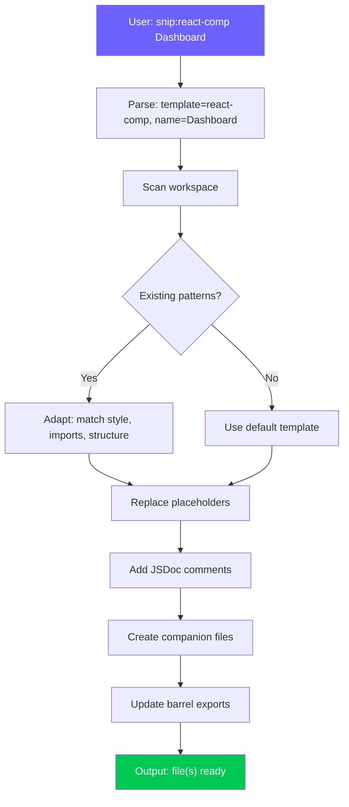

# ⚡ Snippet Factory Skill — v2.0 Pro Edition

> **Version:** 2.0 Pro · **Updated:** 2026-04-19 · **Category:** Code Generation  
> **Changelog v2.0:** Snippet catalog table, auto-detect workspace context, versioned templates, quick-insert tags (`snip:`), smart adaptation to existing codebase style, cross-skill integration, expanded ESP32/Python/Next.js templates.

---

## 1. Mục tiêu (Objective)
Lưu trữ, quản lý và sinh nhanh các **code patterns/snippets** mà user thường xuyên sử dụng — từ boilerplate setup đến component templates — để không phải viết lại từ đầu mỗi lần. Snippets tự động thích nghi với tech stack và coding style của workspace hiện tại.

**Triết lý:** *"Don't type it twice. Template it once."*

**Cross-skill Integration:**
- **Architecture Planner** approve blueprint → Snippet Factory tự sinh tất cả boilerplate files
- **Code Review** phát hiện code duplication → gợi ý extract thành snippet mới
- **Smart Docs Generator** tự thêm JSDoc/docstring vào snippet output

---

## 2. Trigger — Khi nào kích hoạt

| Trigger Pattern | Ví dụ | Action |
|---|---|---|
| Quick-insert tag | `snip: react-component Dashboard` | Sinh snippet ngay |
| Tạo component/file mới | *"tạo component mới"*, *"new React hook"* | Chọn template phù hợp |
| Setup boilerplate | *"setup project"*, *"init ESP32"* | Full project scaffold |
| Từ khóa trực tiếp | *"snippet:", "template:", "boilerplate:"* | Hiển thị catalog |
| Pattern lặp lại nhận diện | AI nhận ra user đang viết giống template | Gợi ý dùng snippet |
| Post-blueprint generation | Architecture Planner vừa approved | Auto-gen all files từ blueprint |

---

## 3. Snippet Catalog — Bảng tra nhanh

### 📋 Master Catalog

| ID | Tag | Tên | Tech | Description |
|---|---|---|---|---|
| R01 | `snip:react-comp` | React Component | React + TS | FC với props interface, CSS module |
| R02 | `snip:react-hook` | Custom Hook | React + TS | Hook pattern với loading/error/data |
| R03 | `snip:react-context` | Context Provider | React + TS | Context + Provider + useContext hook |
| R04 | `snip:zustand` | Zustand Store | Zustand + TS | Store với devtools + persist |
| R05 | `snip:api-service` | API Service | Fetch + TS | RESTful service module |
| R06 | `snip:react-form` | Form Component | React + TS | Controlled form with validation |
| R07 | `snip:react-modal` | Modal Component | React + TS | Portal-based modal with animations |
| R08 | `snip:react-table` | Data Table | React + TS | Sortable, filterable table |
| C01 | `snip:css-tokens` | CSS Design Tokens | CSS | Full design system variables |
| C02 | `snip:css-glass` | Glassmorphism | CSS | Glass card + hover effect |
| C03 | `snip:css-layout` | Responsive Layout | CSS | Grid + flexbox page layout |
| C04 | `snip:css-animation` | Animation Library | CSS | Keyframes collection |
| C05 | `snip:hyperframes` | Video Generator | HTML/GSAP | Sinh nền video UI bằng npx hyperframes |
| E01 | `snip:esp-setup` | ESP32 Setup | PlatformIO | platformio.ini + main.cpp |
| E02 | `snip:esp-wifi` | WiFi + OTA | Arduino | WiFi connect + OTA update |
| E03 | `snip:esp-task` | FreeRTOS Task | Arduino | Task template with handle |
| E04 | `snip:esp-sensor` | Sensor Reader | Arduino | I2C/SPI sensor with filtering |
| E05 | `snip:esp-webserver` | Web Server | Arduino | AsyncWebServer + API endpoints |
| E06 | `snip:esp-mqtt` | MQTT Client | Arduino | MQTT pub/sub with reconnect |
| P01 | `snip:py-script` | Python Script | Python 3.10+ | Main + logging + dotenv |
| P02 | `snip:py-class` | Python Dataclass | Python 3.10+ | Dataclass + validation + serialization |
| P03 | `snip:py-api` | FastAPI App | FastAPI | App + router + models + CORS |
| P04 | `snip:py-test` | Pytest Suite | Pytest | Test file with fixtures |
| N01 | `snip:next-page` | Next.js Page | Next.js 14+ | Server component page |
| N02 | `snip:next-api` | Next.js API Route | Next.js 14+ | API route handler |
| G01 | `snip:git-hooks` | Git Hooks | Husky + lint-staged | Pre-commit hooks |
| G02 | `snip:docker` | Dockerfile | Docker | Multi-stage Dockerfile |
| G03 | `snip:ci-github` | GitHub Actions | GitHub | CI/CD workflow |

---

## 4. Snippet Templates — Chi tiết

### 📂 Category: React / Frontend

#### R01 — React Component (TypeScript)
```tsx
// snip:react-comp {{Name}}
// Generated by Snippet Factory v2.0

import { type FC, memo } from 'react';
import styles from './{{Name}}.module.css';

// ─── Types ──────────────────────────────
interface {{Name}}Props {
  /** Primary content or data */
  children?: React.ReactNode;
  /** Additional CSS class */
  className?: string;
}

// ─── Component ──────────────────────────
const {{Name}}: FC<{{Name}}Props> = memo(({ children, className }) => {
  return (
    <div className={`${styles.container} ${className ?? ''}`}>
      {children}
    </div>
  );
});

{{Name}}.displayName = '{{Name}}';

export default {{Name}};
```

```css
/* {{Name}}.module.css */
.container {
  /* Layout */
  display: flex;
  flex-direction: column;
  gap: var(--space-md, 1rem);

  /* Style */
  padding: var(--space-lg, 1.5rem);
  border-radius: var(--radius-md, 12px);
  background: var(--color-bg-elevated, #1a1a2e);
  border: 1px solid var(--color-border, rgba(255, 255, 255, 0.06));
  
  /* Transition */
  transition: all var(--transition-normal, 300ms) ease;
}

.container:hover {
  border-color: var(--color-border-hover, rgba(255, 255, 255, 0.12));
  transform: translateY(-1px);
}
```

```tsx
// index.ts (barrel export)
export { default as {{Name}} } from './{{Name}}';
export type { {{Name}}Props } from './{{Name}}';
```

#### R02 — Custom Hook with Full Pattern
```tsx
// snip:react-hook {{useName}}

import { useState, useEffect, useCallback, useRef } from 'react';

// ─── Types ──────────────────────────────
interface {{UseName}}Options {
  /** Enable auto-fetch on mount */
  autoFetch?: boolean;
  /** Refetch interval in ms (0 = disabled) */
  refetchInterval?: number;
}

interface {{UseName}}Return<T> {
  data: T | null;
  loading: boolean;
  error: Error | null;
  refetch: () => Promise<void>;
  reset: () => void;
}

// ─── Hook ───────────────────────────────
export function {{useName}}<T = unknown>(
  options: {{UseName}}Options = {}
): {{UseName}}Return<T> {
  const { autoFetch = true, refetchInterval = 0 } = options;

  const [data, setData] = useState<T | null>(null);
  const [loading, setLoading] = useState(autoFetch);
  const [error, setError] = useState<Error | null>(null);
  const abortRef = useRef<AbortController | null>(null);

  const fetchData = useCallback(async () => {
    // Abort previous request
    abortRef.current?.abort();
    abortRef.current = new AbortController();

    try {
      setLoading(true);
      setError(null);

      // TODO: Replace with actual data fetching logic
      // const response = await fetch(url, { signal: abortRef.current.signal });
      // const result = await response.json();
      // setData(result);
    } catch (err) {
      if (err instanceof DOMException && err.name === 'AbortError') return;
      setError(err instanceof Error ? err : new Error('Unknown error'));
    } finally {
      setLoading(false);
    }
  }, []);

  const reset = useCallback(() => {
    setData(null);
    setLoading(false);
    setError(null);
  }, []);

  // Auto-fetch on mount
  useEffect(() => {
    if (autoFetch) fetchData();
    return () => abortRef.current?.abort();
  }, [autoFetch, fetchData]);

  // Refetch interval
  useEffect(() => {
    if (!refetchInterval) return;
    const id = setInterval(fetchData, refetchInterval);
    return () => clearInterval(id);
  }, [refetchInterval, fetchData]);

  return { data, loading, error, refetch: fetchData, reset };
}
```

#### R04 — Zustand Store (Full-featured)
```tsx
// snip:zustand {{Name}}

import { create } from 'zustand';
import { devtools, persist, subscribeWithSelector } from 'zustand/middleware';
import { immer } from 'zustand/middleware/immer';

// ─── Types ──────────────────────────────
interface {{Name}}Item {
  id: string;
  // TODO: Define item fields
}

interface {{Name}}State {
  // ── State ──
  items: {{Name}}Item[];
  selectedId: string | null;
  loading: boolean;
  error: Error | null;
  filter: string;

  // ── Computed (via getters) ──
  // Use selectors instead

  // ── Actions ──
  addItem: (item: Omit<{{Name}}Item, 'id'>) => void;
  updateItem: (id: string, updates: Partial<{{Name}}Item>) => void;
  removeItem: (id: string) => void;
  selectItem: (id: string | null) => void;
  setFilter: (filter: string) => void;
  setLoading: (loading: boolean) => void;
  setError: (error: Error | null) => void;
  reset: () => void;
}

// ─── Initial State ──────────────────────
const initialState = {
  items: [] as {{Name}}Item[],
  selectedId: null as string | null,
  loading: false,
  error: null as Error | null,
  filter: '',
};

// ─── Store ──────────────────────────────
export const use{{Name}}Store = create<{{Name}}State>()(
  devtools(
    persist(
      subscribeWithSelector(
        immer((set) => ({
          ...initialState,

          addItem: (item) =>
            set((state) => {
              state.items.push({
                ...item,
                id: crypto.randomUUID(),
              });
            }, false, 'addItem'),

          updateItem: (id, updates) =>
            set((state) => {
              const index = state.items.findIndex((i) => i.id === id);
              if (index !== -1) {
                Object.assign(state.items[index], updates);
              }
            }, false, 'updateItem'),

          removeItem: (id) =>
            set((state) => {
              state.items = state.items.filter((i) => i.id !== id);
              if (state.selectedId === id) state.selectedId = null;
            }, false, 'removeItem'),

          selectItem: (id) => set({ selectedId: id }, false, 'selectItem'),
          setFilter: (filter) => set({ filter }, false, 'setFilter'),
          setLoading: (loading) => set({ loading }, false, 'setLoading'),
          setError: (error) => set({ error }, false, 'setError'),
          reset: () => set(initialState, false, 'reset'),
        }))
      ),
      { name: '{{name}}-storage' }
    ),
    { name: '{{Name}}Store' }
  )
);

// ─── Selectors (Performance Optimized) ──
export const use{{Name}}Items = () => use{{Name}}Store((s) => s.items);
export const use{{Name}}Loading = () => use{{Name}}Store((s) => s.loading);
export const useFiltered{{Name}}s = () =>
  use{{Name}}Store((s) => {
    if (!s.filter) return s.items;
    const q = s.filter.toLowerCase();
    return s.items.filter((i) => JSON.stringify(i).toLowerCase().includes(q));
  });
```

---

### 📂 Category: CSS / Styling

#### C01 — CSS Design Tokens (Pro Dark Theme)
```css
/* snip:css-tokens */
/* Design System Tokens — v2.0 */
/* Generated by Snippet Factory */

:root {
  /* ── Color Palette ── */
  /* Background */
  --color-bg-primary: #08080f;
  --color-bg-secondary: #0f0f1a;
  --color-bg-elevated: #161625;
  --color-bg-surface: #1c1c30;
  --color-bg-glass: rgba(255, 255, 255, 0.02);
  --color-bg-glass-hover: rgba(255, 255, 255, 0.05);
  --color-bg-overlay: rgba(0, 0, 0, 0.6);

  /* Text */
  --color-text-primary: #f0f0f8;
  --color-text-secondary: #9090a8;
  --color-text-muted: #606078;
  --color-text-inverse: #08080f;

  /* Accent */
  --color-accent: #6c63ff;
  --color-accent-hover: #7b73ff;
  --color-accent-active: #5b53ee;
  --color-accent-subtle: rgba(108, 99, 255, 0.12);
  --color-accent-glow: rgba(108, 99, 255, 0.25);

  /* Semantic */
  --color-success: #00c853;
  --color-success-subtle: rgba(0, 200, 83, 0.12);
  --color-warning: #ffc107;
  --color-warning-subtle: rgba(255, 193, 7, 0.12);
  --color-error: #ff3d57;
  --color-error-subtle: rgba(255, 61, 87, 0.12);
  --color-info: #2196f3;
  --color-info-subtle: rgba(33, 150, 243, 0.12);

  /* Border */
  --color-border: rgba(255, 255, 255, 0.06);
  --color-border-hover: rgba(255, 255, 255, 0.12);
  --color-border-focus: var(--color-accent);
  --color-border-error: var(--color-error);

  /* ── Typography ── */
  --font-sans: 'Inter', -apple-system, BlinkMacSystemFont, 'Segoe UI', sans-serif;
  --font-mono: 'JetBrains Mono', 'Fira Code', 'Cascadia Code', monospace;
  --font-display: 'Outfit', var(--font-sans);

  --text-xs: clamp(0.7rem, 0.65rem + 0.25vw, 0.75rem);
  --text-sm: clamp(0.8rem, 0.75rem + 0.25vw, 0.875rem);
  --text-base: clamp(0.9rem, 0.85rem + 0.25vw, 1rem);
  --text-lg: clamp(1.05rem, 1rem + 0.25vw, 1.125rem);
  --text-xl: clamp(1.15rem, 1.05rem + 0.5vw, 1.25rem);
  --text-2xl: clamp(1.35rem, 1.2rem + 0.75vw, 1.5rem);
  --text-3xl: clamp(1.7rem, 1.4rem + 1.5vw, 2rem);
  --text-4xl: clamp(2rem, 1.6rem + 2vw, 2.5rem);
  --text-hero: clamp(2.5rem, 2rem + 3vw, 4.5rem);

  --leading-tight: 1.2;
  --leading-normal: 1.5;
  --leading-relaxed: 1.75;

  --font-weight-normal: 400;
  --font-weight-medium: 500;
  --font-weight-semibold: 600;
  --font-weight-bold: 700;

  /* ── Spacing ── */
  --space-0: 0;
  --space-1: 0.25rem;   /* 4px */
  --space-2: 0.5rem;    /* 8px */
  --space-3: 0.75rem;   /* 12px */
  --space-4: 1rem;      /* 16px */
  --space-5: 1.25rem;   /* 20px */
  --space-6: 1.5rem;    /* 24px */
  --space-8: 2rem;      /* 32px */
  --space-10: 2.5rem;   /* 40px */
  --space-12: 3rem;     /* 48px */
  --space-16: 4rem;     /* 64px */
  --space-20: 5rem;     /* 80px */
  --space-24: 6rem;     /* 96px */

  /* ── Border Radius ── */
  --radius-none: 0;
  --radius-sm: 6px;
  --radius-md: 10px;
  --radius-lg: 14px;
  --radius-xl: 20px;
  --radius-2xl: 28px;
  --radius-full: 9999px;

  /* ── Shadows ── */
  --shadow-xs: 0 1px 2px rgba(0, 0, 0, 0.2);
  --shadow-sm: 0 2px 4px rgba(0, 0, 0, 0.25);
  --shadow-md: 0 4px 12px rgba(0, 0, 0, 0.35);
  --shadow-lg: 0 8px 24px rgba(0, 0, 0, 0.4);
  --shadow-xl: 0 16px 48px rgba(0, 0, 0, 0.5);
  --shadow-glow: 0 0 20px var(--color-accent-glow);
  --shadow-glow-lg: 0 0 40px var(--color-accent-glow);
  --shadow-inner: inset 0 2px 4px rgba(0, 0, 0, 0.3);

  /* ── Transitions ── */
  --duration-instant: 50ms;
  --duration-fast: 150ms;
  --duration-normal: 300ms;
  --duration-slow: 500ms;
  --duration-slower: 800ms;

  --ease-default: cubic-bezier(0.4, 0, 0.2, 1);
  --ease-in: cubic-bezier(0.4, 0, 1, 1);
  --ease-out: cubic-bezier(0, 0, 0.2, 1);
  --ease-spring: cubic-bezier(0.34, 1.56, 0.64, 1);
  --ease-bounce: cubic-bezier(0.68, -0.55, 0.265, 1.55);

  --transition-colors: color var(--duration-fast) var(--ease-default),
                        background-color var(--duration-fast) var(--ease-default),
                        border-color var(--duration-fast) var(--ease-default);
  --transition-transform: transform var(--duration-normal) var(--ease-spring);
  --transition-opacity: opacity var(--duration-normal) var(--ease-default);
  --transition-all: all var(--duration-normal) var(--ease-default);

  /* ── Z-Index Scale ── */
  --z-base: 0;
  --z-elevated: 10;
  --z-dropdown: 100;
  --z-sticky: 200;
  --z-overlay: 300;
  --z-modal: 400;
  --z-popover: 500;
  --z-toast: 600;
  --z-tooltip: 700;
  --z-max: 9999;

  /* ── Breakpoints (for reference, use in @media) ── */
  /* --bp-sm: 640px; */
  /* --bp-md: 768px; */
  /* --bp-lg: 1024px; */
  /* --bp-xl: 1280px; */
  /* --bp-2xl: 1536px; */
}

/* ── Reduced Motion ── */
@media (prefers-reduced-motion: reduce) {
  :root {
    --duration-instant: 0ms;
    --duration-fast: 0ms;
    --duration-normal: 0ms;
    --duration-slow: 0ms;
    --duration-slower: 0ms;
  }
}
```

#### C04 — Animation Library
```css
/* snip:css-animation */
/* Reusable Keyframe Animations */

/* ── Entrance Animations ── */
@keyframes fadeIn {
  from { opacity: 0; }
  to { opacity: 1; }
}

@keyframes fadeInUp {
  from { opacity: 0; transform: translateY(20px); }
  to { opacity: 1; transform: translateY(0); }
}

@keyframes fadeInDown {
  from { opacity: 0; transform: translateY(-20px); }
  to { opacity: 1; transform: translateY(0); }
}

@keyframes fadeInScale {
  from { opacity: 0; transform: scale(0.95); }
  to { opacity: 1; transform: scale(1); }
}

@keyframes slideInRight {
  from { opacity: 0; transform: translateX(30px); }
  to { opacity: 1; transform: translateX(0); }
}

@keyframes slideInLeft {
  from { opacity: 0; transform: translateX(-30px); }
  to { opacity: 1; transform: translateX(0); }
}

/* ── Interactive ── */
@keyframes pulse {
  0%, 100% { transform: scale(1); }
  50% { transform: scale(1.05); }
}

@keyframes glow {
  0%, 100% { box-shadow: 0 0 5px var(--color-accent-glow); }
  50% { box-shadow: 0 0 25px var(--color-accent-glow); }
}

@keyframes shimmer {
  0% { background-position: -200% 0; }
  100% { background-position: 200% 0; }
}

@keyframes spin {
  from { transform: rotate(0deg); }
  to { transform: rotate(360deg); }
}

@keyframes float {
  0%, 100% { transform: translateY(0); }
  50% { transform: translateY(-10px); }
}

/* ── Utility Classes ── */
.animate-fade-in { animation: fadeIn var(--duration-normal) var(--ease-out) both; }
.animate-fade-in-up { animation: fadeInUp var(--duration-normal) var(--ease-out) both; }
.animate-fade-in-scale { animation: fadeInScale var(--duration-normal) var(--ease-spring) both; }
.animate-slide-in-right { animation: slideInRight var(--duration-normal) var(--ease-out) both; }
.animate-pulse { animation: pulse 2s var(--ease-default) infinite; }
.animate-glow { animation: glow 2s var(--ease-default) infinite; }
.animate-shimmer {
  background: linear-gradient(90deg, transparent 0%, rgba(255,255,255,0.05) 50%, transparent 100%);
  background-size: 200% 100%;
  animation: shimmer 2s infinite;
}
.animate-spin { animation: spin 1s linear infinite; }
.animate-float { animation: float 3s var(--ease-default) infinite; }

/* ── Stagger Support ── */
.stagger > * { animation-fill-mode: both; }
.stagger > *:nth-child(1) { animation-delay: 0ms; }
.stagger > *:nth-child(2) { animation-delay: 50ms; }
.stagger > *:nth-child(3) { animation-delay: 100ms; }
.stagger > *:nth-child(4) { animation-delay: 150ms; }
.stagger > *:nth-child(5) { animation-delay: 200ms; }
.stagger > *:nth-child(6) { animation-delay: 250ms; }
.stagger > *:nth-child(7) { animation-delay: 300ms; }
.stagger > *:nth-child(8) { animation-delay: 350ms; }
```

#### C05 — Hyperframes Video Generator (AI Backgrounds)
```html
<!-- snip:hyperframes -->
<!-- Generated by Snippet Factory v2.0 -->
<!-- Run: npx hyperframes render -->

<!DOCTYPE html>
<html lang="en">
<head>
  <style>
    /* CSS Grid / Flexbox full màn hình để render video */
    body {
      margin: 0;
      width: 1920px;
      height: 1080px;
      background: var(--color-bg-primary, #000);
      overflow: hidden;
      display: flex;
      justify-content: center;
      align-items: center;
    }
    
    .mesh-gradient {
      position: absolute;
      width: 150vw;
      height: 150vh;
      /* Thay đổi mã màu cho Premium UI */
      background: radial-gradient(circle at 50% 50%, rgba(108, 99, 255, 0.4), transparent 50%),
                  radial-gradient(circle at 80% 20%, rgba(0, 200, 83, 0.2), transparent 50%);
      filter: blur(80px);
      opacity: 0;
    }
  </style>
</head>
<body>
  <!-- Khung timeline video: 10 giây -->
  <div id="stage" data-composition-id="bg-video" data-start="0" data-duration="10" data-width="1920" data-height="1080">
    <div class="mesh-gradient" id="mesh1"></div>
  </div>

  <!-- Thêm GSAP từ CDN để tạo animation -->
  <script src="https://cdnjs.cloudflare.com/ajax/libs/gsap/3.12.2/gsap.min.js"></script>
  <script>
    // Animation mượt mà 60fps cho background
    gsap.to("#mesh1", {
      opacity: 1,
      duration: 2,
      ease: "power2.inOut"
    });
    
    gsap.to("#mesh1", {
      rotation: 360,
      scale: 1.2,
      x: 200,
      y: -100,
      duration: 10,
      ease: "linear",
      repeat: -1
    });
  </script>
</body>
</html>
```

---

### 📂 Category: ESP32 / Firmware

#### E01 — ESP32-S3 PlatformIO Full Setup
```ini
; snip:esp-setup
; ESP32-S3 Project Template — Snippet Factory v2.0

[env:esp32s3]
platform = espressif32
board = esp32-s3-devkitc-1
framework = arduino
monitor_speed = 115200
upload_speed = 921600
board_build.mcu = esp32s3
board_build.f_cpu = 240000000L
board_build.flash_mode = dio
board_build.flash_size = 16MB
board_build.partitions = huge_app.csv

; Uncomment if using PSRAM
; board_build.arduino.memory_type = qio_opi

lib_deps =
  ; Common libraries — uncomment as needed
  ; bblanchon/ArduinoJson@^7.0.0
  ; me-no-dev/AsyncTCP
  ; me-no-dev/ESPAsyncWebServer

build_flags =
  -DCORE_DEBUG_LEVEL=3
  -DARDUINO_USB_CDC_ON_BOOT=1
  ; -DBOARD_HAS_PSRAM

monitor_filters = 
  esp32_exception_decoder
  default
```

```cpp
// main.cpp — ESP32-S3 Entry Point
#include <Arduino.h>
#include "config.h"

// ─── Task Handles ───────────────────────
// TaskHandle_t sensorTaskHandle = NULL;

void setup() {
  Serial.begin(115200);
  delay(1000);  // Wait for serial monitor
  
  Serial.println("╔════════════════════════════╗");
  Serial.println("║  {{PROJECT_NAME}} v1.0     ║");
  Serial.println("║  ESP32-S3 Starting...      ║");
  Serial.println("╚════════════════════════════╝");

  // ── Hardware Init ──
  // setupPins();
  // setupSensors();
  // setupMotors();

  // ── Communication Init ──
  // setupWiFi();
  // setupBLE();
  // setupMQTT();

  // ── Task Creation ──
  // xTaskCreatePinnedToCore(sensorTask, "Sensor", 4096, NULL, 2, &sensorTaskHandle, 1);

  Serial.println("✅ Setup complete!");
}

void loop() {
  // Main loop (or use FreeRTOS tasks)
  vTaskDelay(pdMS_TO_TICKS(1000));
}
```

```cpp
// config.h — Pin Definitions & Constants
#pragma once

// ── Application Config ──────────────────
#define APP_NAME        "{{PROJECT_NAME}}"
#define APP_VERSION     "1.0.0"

// ── Pin Definitions ─────────────────────
// ⚠️ ESP32-S3 Safe GPIOs: 1-21, 35-45, 47-48
// ❌ Avoid: 0 (Boot), 3 (JTAG), 19-20 (USB), 26-32 (Flash/PSRAM)

// Motors
// #define PIN_MOTOR_L1    5
// #define PIN_MOTOR_L2    6
// #define PIN_MOTOR_R1    7
// #define PIN_MOTOR_R2    15

// Sensors
// #define PIN_SDA         8
// #define PIN_SCL         9
// #define PIN_TRIGGER     10
// #define PIN_ECHO        11

// LEDs / Indicators
// #define PIN_LED_STATUS  48  // Built-in RGB on some boards
// #define PIN_BUZZER      12

// ── Communication Config ────────────────
// #define WIFI_SSID       "YOUR_SSID"
// #define WIFI_PASS       "YOUR_PASS"
// #define MQTT_BROKER     "broker.hivemq.com"
// #define MQTT_PORT       1883

// ── Task Config ─────────────────────────
#define TASK_STACK_SIZE   4096
#define TASK_PRIORITY_LOW    1
#define TASK_PRIORITY_MED    2
#define TASK_PRIORITY_HIGH   3

// ── Timing Config ───────────────────────
#define SENSOR_READ_INTERVAL_MS   100
#define MOTOR_UPDATE_INTERVAL_MS  50
#define WIFI_RECONNECT_INTERVAL_MS 5000
```

#### E06 — MQTT Client with Reconnect
```cpp
// snip:esp-mqtt
#include <WiFi.h>
#include <PubSubClient.h>
#include "config.h"

WiFiClient espClient;
PubSubClient mqtt(espClient);

unsigned long lastReconnectAttempt = 0;
const long RECONNECT_INTERVAL = 5000;

// ── MQTT Callback ───────────────────────
void mqttCallback(char* topic, byte* payload, unsigned int length) {
  String message;
  message.reserve(length);
  for (unsigned int i = 0; i < length; i++) {
    message += (char)payload[i];
  }
  
  Serial.printf("📩 [%s] %s\n", topic, message.c_str());

  // Handle messages by topic
  if (String(topic) == "device/command") {
    // Process command
  }
}

// ── MQTT Connect ────────────────────────
bool mqttConnect() {
  String clientId = "esp32-" + String(random(0xffff), HEX);
  
  if (mqtt.connect(clientId.c_str())) {
    Serial.println("✅ MQTT connected!");
    
    // Subscribe to topics
    mqtt.subscribe("device/command");
    mqtt.subscribe("device/config");
    
    // Publish online status
    mqtt.publish("device/status", "online", true);  // retained
    
    return true;
  }
  
  Serial.printf("❌ MQTT failed, rc=%d\n", mqtt.state());
  return false;
}

// ── MQTT Setup ──────────────────────────
void setupMQTT() {
  mqtt.setServer(MQTT_BROKER, MQTT_PORT);
  mqtt.setCallback(mqttCallback);
  mqtt.setBufferSize(1024);  // Increase if needed
  mqttConnect();
}

// ── MQTT Loop (call in loop() or task) ──
void mqttLoop() {
  if (!mqtt.connected()) {
    unsigned long now = millis();
    if (now - lastReconnectAttempt > RECONNECT_INTERVAL) {
      lastReconnectAttempt = now;
      if (mqttConnect()) {
        lastReconnectAttempt = 0;
      }
    }
  } else {
    mqtt.loop();
  }
}

// ── Publish Helper ──────────────────────
void mqttPublish(const char* topic, const char* payload, bool retained = false) {
  if (mqtt.connected()) {
    mqtt.publish(topic, payload, retained);
    Serial.printf("📤 [%s] %s\n", topic, payload);
  } else {
    Serial.println("⚠️ MQTT not connected, message queued");
  }
}
```

---

### 📂 Category: Python

#### P01 — Python Script (Pro Boilerplate)
```python
#!/usr/bin/env python3
"""
{{Name}} — {{Description}}

Usage:
    python {{name}}.py [options]

Author: {{author}}
Date: {{date}}
Version: 1.0.0
"""

import os
import sys
import logging
import argparse
from pathlib import Path
from typing import Optional
from dataclasses import dataclass
from dotenv import load_dotenv

# ── Configuration ────────────────────────
load_dotenv()

BASE_DIR = Path(__file__).parent
LOG_DIR = BASE_DIR / "logs"
LOG_DIR.mkdir(exist_ok=True)

# ── Logging Setup ────────────────────────
def setup_logging(verbose: bool = False) -> logging.Logger:
    """Configure structured logging with file + console output."""
    level = logging.DEBUG if verbose else logging.INFO
    
    formatter = logging.Formatter(
        "%(asctime)s [%(levelname)-8s] %(name)s: %(message)s",
        datefmt="%Y-%m-%d %H:%M:%S",
    )
    
    logger = logging.getLogger("{{name}}")
    logger.setLevel(level)
    
    # Console handler
    console = logging.StreamHandler(sys.stdout)
    console.setFormatter(formatter)
    logger.addHandler(console)
    
    # File handler
    file_handler = logging.FileHandler(
        LOG_DIR / "{{name}}.log", encoding="utf-8"
    )
    file_handler.setFormatter(formatter)
    logger.addHandler(file_handler)
    
    return logger


# ── CLI Arguments ────────────────────────
def parse_args() -> argparse.Namespace:
    """Parse command line arguments."""
    parser = argparse.ArgumentParser(
        description="{{Description}}",
        formatter_class=argparse.RawDescriptionHelpFormatter,
    )
    parser.add_argument("-v", "--verbose", action="store_true", help="Enable debug logging")
    parser.add_argument("-o", "--output", type=Path, default=None, help="Output file path")
    # Add more arguments as needed
    
    return parser.parse_args()


# ── Main Logic ───────────────────────────
def main() -> int:
    """Main entry point. Returns exit code."""
    args = parse_args()
    logger = setup_logging(verbose=args.verbose)
    
    logger.info("🚀 Starting {{Name}}...")
    logger.debug(f"Arguments: {args}")

    try:
        # ── Core Logic Here ──
        # result = process(args)
        
        logger.info("✅ Completed successfully!")
        return 0
        
    except KeyboardInterrupt:
        logger.info("⛔ Interrupted by user")
        return 130
    except FileNotFoundError as e:
        logger.error(f"📁 File not found: {e}")
        return 1
    except Exception as e:
        logger.error(f"💥 Unexpected error: {e}", exc_info=True)
        return 1


if __name__ == "__main__":
    sys.exit(main())
```

#### P03 — FastAPI App
```python
# snip:py-api
"""
{{Name}} API — FastAPI Application

Run: uvicorn main:app --reload --port 8000
"""

from fastapi import FastAPI, HTTPException, Depends, Query
from fastapi.middleware.cors import CORSMiddleware
from pydantic import BaseModel, Field
from typing import Optional
from datetime import datetime
from uuid import uuid4

# ── App Setup ────────────────────────────
app = FastAPI(
    title="{{Name}} API",
    description="{{Description}}",
    version="1.0.0",
)

app.add_middleware(
    CORSMiddleware,
    allow_origins=["*"],  # Restrict in production!
    allow_credentials=True,
    allow_methods=["*"],
    allow_headers=["*"],
)

# ── Models ───────────────────────────────
class ItemCreate(BaseModel):
    """Request model for creating an item."""
    name: str = Field(..., min_length=1, max_length=255)
    description: Optional[str] = Field(None, max_length=1000)

class ItemResponse(BaseModel):
    """Response model for an item."""
    id: str
    name: str
    description: Optional[str]
    created_at: datetime

class ItemList(BaseModel):
    """Paginated list response."""
    data: list[ItemResponse]
    total: int
    limit: int
    offset: int

# ── In-Memory Store (replace with DB) ───
_store: dict[str, dict] = {}

# ── Routes ───────────────────────────────
@app.get("/api/items", response_model=ItemList)
async def list_items(
    limit: int = Query(50, ge=1, le=100),
    offset: int = Query(0, ge=0),
):
    """List all items with pagination."""
    items = list(_store.values())
    return ItemList(
        data=items[offset:offset + limit],
        total=len(items),
        limit=limit,
        offset=offset,
    )

@app.post("/api/items", response_model=ItemResponse, status_code=201)
async def create_item(item: ItemCreate):
    """Create a new item."""
    new_item = {
        "id": str(uuid4()),
        "name": item.name,
        "description": item.description,
        "created_at": datetime.now(),
    }
    _store[new_item["id"]] = new_item
    return new_item

@app.get("/api/items/{item_id}", response_model=ItemResponse)
async def get_item(item_id: str):
    """Get a single item by ID."""
    if item_id not in _store:
        raise HTTPException(status_code=404, detail="Item not found")
    return _store[item_id]

@app.delete("/api/items/{item_id}", status_code=204)
async def delete_item(item_id: str):
    """Delete an item."""
    if item_id not in _store:
        raise HTTPException(status_code=404, detail="Item not found")
    del _store[item_id]

# ── Health Check ─────────────────────────
@app.get("/health")
async def health():
    return {"status": "ok", "timestamp": datetime.now().isoformat()}
```

---

### 📂 Category: DevOps / Config

#### G03 — GitHub Actions CI/CD
```yaml
# snip:ci-github
# .github/workflows/ci.yml
name: CI/CD

on:
  push:
    branches: [main, dev]
  pull_request:
    branches: [main]

jobs:
  lint-and-test:
    runs-on: ubuntu-latest
    strategy:
      matrix:
        node-version: [18, 20]

    steps:
      - uses: actions/checkout@v4

      - name: Setup Node.js ${{ matrix.node-version }}
        uses: actions/setup-node@v4
        with:
          node-version: ${{ matrix.node-version }}
          cache: 'npm'

      - name: Install dependencies
        run: npm ci

      - name: Lint
        run: npm run lint

      - name: Type check
        run: npx tsc --noEmit

      - name: Test
        run: npm test -- --coverage --passWithNoTests

      - name: Build
        run: npm run build

  # deploy:
  #   needs: lint-and-test
  #   if: github.ref == 'refs/heads/main'
  #   runs-on: ubuntu-latest
  #   steps:
  #     - uses: actions/checkout@v4
  #     - run: npm ci && npm run build
  #     # Add deployment steps here
```

---

## 5. Placeholder Convention

| Placeholder | Case | Example |
|---|---|---|
| `{{Name}}` | PascalCase | `TransactionList`, `UserProfile` |
| `{{name}}` | camelCase | `transactionList`, `userProfile` |
| `{{NAME}}` | UPPER_SNAKE | `TRANSACTION_LIST`, `USER_PROFILE` |
| `{{name-kebab}}` | kebab-case | `transaction-list`, `user-profile` |
| `{{useName}}` | Hook convention | `useTransactions`, `useUserProfile` |
| `{{UseName}}` | Hook type name | `UseTransactions`, `UseUserProfile` |
| `{{Description}}` | Free text | "User profile display component" |
| `{{date}}` | Auto-fill | Current date |
| `{{author}}` | Auto-fill | From git config or workspace |

---

## 6. Auto-Adaptation — Tự điều chỉnh

| Context | Adaptation |
|---|---|
| Workspace has ESLint config | Follow ESLint rules (quotes, semicolons, etc.) |
| Workspace uses tabs | Indent with tabs |
| Workspace uses `styled-components` | Generate styled template instead of CSS modules |
| Workspace uses Tailwind | Generate Tailwind classes instead of vanilla CSS |
| Workspace has `prettier.config.js` | Format output according to Prettier config |
| TypeScript project | Include full type annotations |
| JavaScript project | Remove TypeScript annotations |
| Workspace has existing components | Match naming patterns, import style, folder structure |
| User asked in Vietnamese | Vietnamese comments, English technical terms |

---

## 7. Smart Completion — Quy trình sinh snippet



**After generating snippet:**
1. ✅ Replace ALL placeholders with actual values
2. ✅ Add necessary imports
3. ✅ Create companion files (CSS module, test file, index.ts)
4. ✅ Update parent index.ts/barrel exports
5. ✅ Suggest integration point (*"Import this in App.tsx line 15"*)

---

## 8. Output Format

```markdown
## ⚡ Snippet Generated — [Template ID]

| Metadata | Value |
|---|---|
| **Template** | `snip:react-comp` → React Component |
| **Name** | Dashboard |
| **Files created** | 3 (component + CSS + barrel) |
| **Adapted to** | Existing workspace style ✅ |

### 📄 Files Created:
1. `src/components/Dashboard/Dashboard.tsx` ← main component
2. `src/components/Dashboard/Dashboard.module.css` ← styles
3. `src/components/Dashboard/index.ts` ← barrel export

[CODE BLOCKS FOR EACH FILE]

### 📌 Integration Steps:
1. Import: `import { Dashboard } from '@/components/Dashboard'`
2. Use: `<Dashboard />` in your page component
3. Customize: Edit props interface + styles
```
