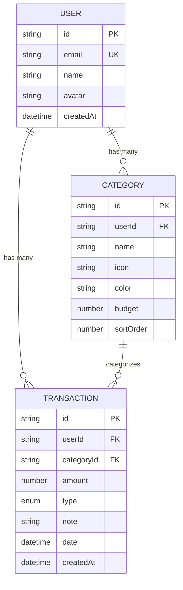
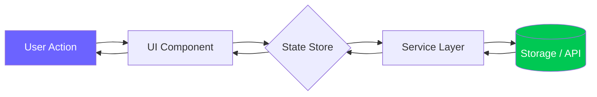
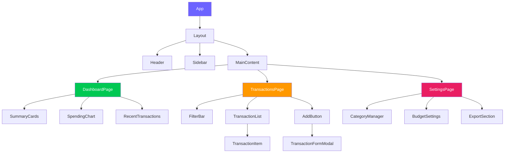
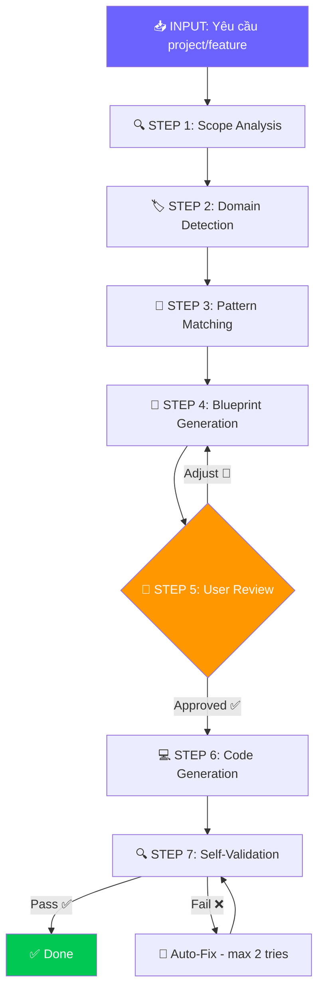
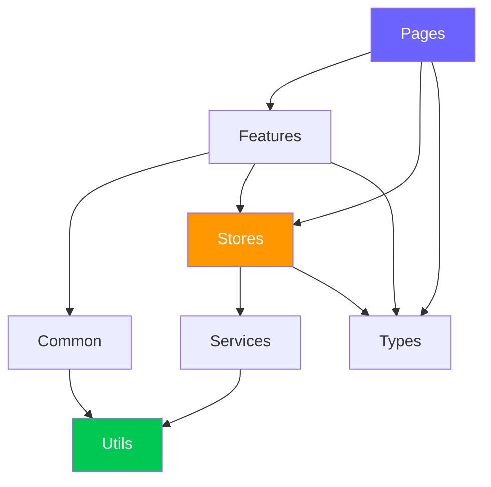

# 🏗️ Code Architecture Planner Skill — v2.0 Pro Edition

> **Version:** 2.0 Pro · **Updated:** 2026-04-19 · **Category:** Planning & Design  
> **Changelog v2.0:** Domain auto-detect, Mermaid diagrams, weighted risk matrix, cross-skill integration, multi-stack templates, adaptive context mining, self-validation pipeline.

---

## 1. Mục tiêu (Objective)
Trước khi viết bất kỳ dòng code nào, skill này buộc AI phải **thiết kế kiến trúc toàn bộ project trước** — bao gồm file structure, data models, component hierarchy, data flow, task breakdown, risk matrix — để code một lần là đúng, tránh refactor đau đớn.

**Triết lý cốt lõi:** *"Measure twice, cut once"* — Nghĩ kỹ 2 lần, code 1 lần.

**Cross-skill Integration:**
- Sau khi blueprint được duyệt → **Snippet Factory** sinh boilerplate từ blueprint
- Khi code xong → **Code Review** tự động review theo blueprint
- Khi cần viết docs → **Smart Docs Generator** dùng blueprint làm source

---

## 2. Trigger — Khi nào kích hoạt

| Trigger Pattern | Ví dụ | Confidence |
|---|---|---|
| Tạo project mới | *"tạo app..."*, *"build website..."*, *"làm project..."* | 🟢 Cao |
| Thêm feature lớn (>3 files) | *"thêm chức năng authentication"* | 🟢 Cao |
| Refactor hệ thống | *"refactor lại cấu trúc"*, *"restructure..."* | 🟢 Cao |
| Từ khóa trực tiếp | *"plan:", "architect:", "thiết kế:", "blueprint:"* | 🟢 Cao |
| Task phức tạp (>3 files) | Bất kỳ task nào cần tạo hoặc sửa > 3 files | 🟡 Trung bình |
| Migration / upgrade | *"upgrade lên React 19"*, *"chuyển sang TypeScript"* | 🟡 Trung bình |

---

## 3. Domain Auto-Detection

Khi nhận yêu cầu, tự phân loại project domain để chọn đúng architecture template:

| Domain | Keywords nhận diện | Architecture Pattern | Template |
|---|---|---|---|
| 🌐 **Web SPA** | react, vue, vite, frontend | Component-Based + Unidirectional Data Flow | `WEB_SPA_ARCH` |
| 🖥️ **Fullstack** | next.js, nuxt, fullstack, api + frontend | Layered + API Routes | `FULLSTACK_ARCH` |
| ⚙️ **Backend API** | express, fastapi, api, server, REST, GraphQL | Layered (Controller → Service → Repository) | `BACKEND_ARCH` |
| 🤖 **Firmware/IoT** | ESP32, Arduino, STM32, firmware, embedded | Task-Based (FreeRTOS) + HAL | `FIRMWARE_ARCH` |
| 🐍 **Python App** | python, script, automation, data | Module-Based + CLI Pattern | `PYTHON_ARCH` |
| 📱 **Mobile** | react native, flutter, mobile app | Screen-Based + Navigation | `MOBILE_ARCH` |
| 🧩 **Monorepo** | monorepo, workspace, multiple packages | Workspace + Shared Packages | `MONOREPO_ARCH` |
| 🤖 **AI/ML** | model, train, dataset, inference | Pipeline-Based (Data → Train → Evaluate → Deploy) | `AI_ML_ARCH` |

---

## 4. Architecture Blueprint — Bản thiết kế 8 phần

Mỗi lần lên kiến trúc, phải sinh đầy đủ các phần sau (tùy project mà bỏ bớt phần không liên quan):

### 4.1 — 📁 File Structure (Cây thư mục)

Tự động sinh dựa trên domain detected. Ví dụ cho Web SPA:

```
project-root/
├── src/
│   ├── components/           # UI components
│   │   ├── common/           # Shared/reusable (Button, Input, Modal...)
│   │   │   ├── Button/
│   │   │   │   ├── Button.tsx
│   │   │   │   ├── Button.module.css
│   │   │   │   └── index.ts
│   │   │   └── ...
│   │   └── features/         # Feature-specific components
│   │       ├── Dashboard/
│   │       └── Settings/
│   ├── hooks/                # Custom React hooks
│   ├── services/             # API calls, external services
│   ├── stores/               # State management (Zustand/Context)
│   ├── utils/                # Pure helper functions
│   ├── types/                # TypeScript interfaces/types
│   ├── constants/            # App-wide constants, enums
│   ├── styles/               # Global styles, design tokens
│   │   ├── tokens.css        # CSS custom properties
│   │   ├── reset.css         # CSS reset
│   │   └── global.css        # Global styles
│   ├── pages/                # Page-level components / routes
│   ├── assets/               # Images, fonts, icons
│   └── App.tsx               # Root component
├── public/                   # Static assets
├── tests/                    # Test files (mirror src/ structure)
│   ├── unit/
│   └── integration/
├── docs/                     # Documentation
├── .env.example              # Environment template
├── tsconfig.json
├── vite.config.ts
└── package.json
```

Ví dụ cho Firmware (ESP32):

```
firmware/
├── src/
│   ├── main.cpp              # Entry point, task creation
│   ├── config.h              # Pin definitions, constants, feature flags
│   ├── hal/                  # Hardware Abstraction Layer
│   │   ├── motor_driver.h/.cpp
│   │   ├── sensor_reader.h/.cpp
│   │   ├── display.h/.cpp
│   │   └── communication.h/.cpp
│   ├── controllers/          # High-level business logic
│   │   ├── navigation.h/.cpp
│   │   ├── safety.h/.cpp
│   │   └── state_machine.h/.cpp
│   ├── tasks/                # FreeRTOS task definitions
│   │   ├── sensor_task.h/.cpp
│   │   ├── motor_task.h/.cpp
│   │   └── comm_task.h/.cpp
│   └── utils/                # Helper functions
│       ├── filters.h/.cpp    # Kalman, moving average...
│       ├── math_utils.h/.cpp
│       └── logger.h/.cpp
├── lib/                      # External libraries
├── test/                     # Unit tests (PlatformIO test framework)
├── docs/                     # Wiring diagrams, datasheets
│   ├── wiring_diagram.md
│   └── pin_mapping.md
├── platformio.ini            # Build config
└── README.md
```

### 4.2 — 📊 Data Models + Entity Relationship

Liệt kê tất cả entities, fields, types, và relationships:

```typescript
// ── Entities ──────────────────────────────
interface User {
  id: string;           // UUID v4
  email: string;        // unique, validated
  name: string;
  avatar?: string;      // URL
  createdAt: Date;
  updatedAt: Date;
}

interface Transaction {
  id: string;
  userId: string;       // FK → User
  categoryId: string;   // FK → Category
  amount: number;       // always positive, type determines sign
  type: 'income' | 'expense';
  note?: string;        // max 500 chars
  date: Date;           // transaction date (user-set)
  createdAt: Date;      // record creation time
}

interface Category {
  id: string;
  userId: string;       // FK → User (user-specific categories)
  name: string;
  icon: string;         // emoji or icon name
  color: string;        // hex color
  budget?: number;      // monthly budget limit (nullable)
  sortOrder: number;    // for custom ordering
}
```

ER Diagram (Mermaid):


### 4.3 — 🔄 Data Flow Diagram



Mô tả chi tiết:
```
User clicks "Add Transaction"
  → TransactionForm component captures input
    → Validates input (client-side)
      → Calls transactionStore.addTransaction(data)
        → Store calls transactionService.create(data)
          → Service writes to localStorage / API
            → Returns success/error
          → Store updates state
        → Component re-renders with new data
      → Toast notification shown
    → Form resets
```

### 4.4 — 🧩 Component Hierarchy



### 4.5 — 📋 Task Breakdown (Phased)

```markdown
## Phase 1 — Foundation (Ưu tiên cao nhất)
- [1.1] Project setup: Vite + TypeScript + ESLint + Prettier
- [1.2] Design tokens: CSS custom properties (colors, typography, spacing)
- [1.3] CSS reset + global styles
- [1.4] Data models: TypeScript interfaces cho tất cả entities
- [1.5] Constants: enums, default categories, config values
  ⏱️ Est: 1-2 giờ | Dependencies: None

## Phase 2 — Core Logic
- [2.1] Storage service: localStorage CRUD wrapper
- [2.2] Transaction store (Zustand): state + actions
- [2.3] Category store: state + actions
- [2.4] Utility functions: currency formatter, date helpers, ID generator
- [2.5] Validation helpers: input sanitization, amount validation
  ⏱️ Est: 2-3 giờ | Dependencies: Phase 1

## Phase 3 — UI Components
- [3.1] Common components: Button, Input, Select, Modal, Toast, EmptyState
- [3.2] Layout: Header, Sidebar, MainContent wrapper
- [3.3] TransactionForm: add/edit modal with validation
- [3.4] TransactionList + TransactionItem: scrollable list with filters
- [3.5] CategoryPicker: icon + color selector
  ⏱️ Est: 3-4 giờ | Dependencies: Phase 1, 2

## Phase 4 — Pages & Integration
- [4.1] Dashboard page: summary cards + charts
- [4.2] Transactions page: full CRUD + filtering
- [4.3] Settings page: category management + budget config
- [4.4] Routing: React Router setup
  ⏱️ Est: 2-3 giờ | Dependencies: Phase 3

## Phase 5 — Polish
- [5.1] Animations: page transitions, micro-interactions
- [5.2] Responsive design: mobile breakpoints
- [5.3] Dark mode refinement
- [5.4] Performance: memo, lazy loading
- [5.5] Testing: critical path tests
  ⏱️ Est: 2-3 giờ | Dependencies: Phase 4
```

### 4.6 — 🔌 API Contracts (nếu có backend)

```yaml
# OpenAPI-style specification
endpoints:
  GET /api/transactions:
    query: { month?, year?, type?, category?, limit?, offset? }
    response: { data: Transaction[], total: number }

  POST /api/transactions:
    body: { amount, type, categoryId, note?, date }
    response: { data: Transaction }
    validation:
      - amount > 0
      - type in ['income', 'expense']
      - categoryId must exist

  PUT /api/transactions/:id:
    body: { amount?, type?, categoryId?, note?, date? }
    response: { data: Transaction }

  DELETE /api/transactions/:id:
    response: { success: boolean }
```

### 4.7 — ⚠️ Risk Assessment (Weighted Matrix)

| # | Rủi ro | Xác suất | Tác động | Risk Score | Mitigation |
|---|---|---|---|---|---|
| 1 | localStorage đầy (>5MB) | 🟡 Trung bình | 🔴 Cao | **6/10** | Pagination, data archiving, quota monitoring |
| 2 | Performance chậm khi >1000 records | 🟡 Trung bình | 🟡 Trung bình | **4/10** | Virtualized list (react-window), indexed search |
| 3 | Data loss khi clear browser | 🔴 Cao | 🔴 Cao | **8/10** | Export/backup feature, optional cloud sync |
| 4 | State desync giữa multiple tabs | 🟢 Thấp | 🟡 Trung bình | **2/10** | StorageEvent listener, BroadcastChannel API |
| 5 | XSS qua note field | 🟢 Thấp | 🔴 Cao | **3/10** | DOMPurify sanitization, CSP headers |
| 6 | Incorrect currency math (float) | 🟡 Trung bình | 🟡 Trung bình | **4/10** | Integer-based math (store as VND cents) |

> **Risk Score = Probability × Impact** (1-10 scale). Items with score ≥6 cần xử lý TRƯỚC khi code.

### 4.8 — 🧪 Testing Strategy

```markdown
## Testing Pyramid

Unit Tests (60%):
  - Utility functions: currency format, date helpers
  - Store actions: add/remove/update transaction
  - Validation helpers: input sanitization
  → Tool: Vitest

Integration Tests (30%):
  - Component + Store integration
  - Form submission → Store update → UI re-render
  - Filter + Sort combination
  → Tool: Testing Library

E2E Tests (10%):
  - Critical user flows: add transaction → see in dashboard
  - Budget alert trigger
  → Tool: Playwright (nếu cần)
```

---

## 5. Architecture Decision Records (ADR)

Ghi lại các quyết định kiến trúc quan trọng và lý do:

```markdown
### ADR-001: State Management → Zustand
**Context:** Cần state management cho transaction data, category data, UI state
**Decision:** Dùng Zustand thay vì Redux hoặc Context
**Reason:**
  - Boilerplate ít hơn Redux 80%
  - Performance tốt hơn Context (no unnecessary re-renders)
  - Built-in persist middleware cho localStorage
  - DevTools support
**Trade-off:** Team lớn có thể prefer Redux cho strict patterns

### ADR-002: Storage → localStorage (MVP) → API (Later)
**Context:** MVP cần chạy offline, không cần backend setup
**Decision:** localStorage cho MVP, thiết kế service layer abstract để dễ migrate
**Reason:**
  - Zero setup, works offline
  - Service layer abstraction cho phép swap sang REST API sau
**Trade-off:** Giới hạn 5MB, không sync cross-device
```

---

## 6. Workflow — Quy trình thiết kế



**Step Details:**

| Step | Action | Output |
|---|---|---|
| 1. Scope Analysis | Xác định project type, scale, user target | Scope document |
| 2. Domain Detection | Auto-detect từ keywords → chọn template | Domain tag |
| 3. Pattern Matching | Scan workspace, kiểm tra tech stack hiện có | Matched patterns |
| 4. Blueprint Gen | Sinh 8 phần blueprint | Full blueprint |
| 5. User Review | Trình bày + hỏi confirm/adjust | Approval |
| 6. Code Gen | Code theo blueprint (tích hợp Snippet Factory) | Working code |
| 7. Self-Validation | Chạy lint/test, verify structure | Pass/Fail |

---

## 7. Design Principles — Nguyên tắc thiết kế

### 7.1 — Separation of Concerns
```
UI Components → chỉ lo hiển thị, nhận props, emit events
Hooks         → chỉ lo logic tái sử dụng, side effects
Stores        → chỉ lo state management
Services      → chỉ lo giao tiếp external (API, storage)
Utils         → chỉ lo pure functions (format, calculate, validate)
Types         → chỉ lo type definitions
Constants     → chỉ lo static values
```

### 7.2 — Dependency Direction (KHÔNG BAO GIỜ đảo chiều!)


### 7.3 — KISS + YAGNI
- **Không** tạo abstraction layer khi chỉ có 1 implementation
- **Không** thêm feature "phòng khi cần"  
- File < 200 LOC. Function < 30 LOC. Nếu dài hơn → TÁCH
- Chọn giải pháp đơn giản nhất mà vẫn đúng

### 7.4 — DRY with Judgment
- Copy-paste > 2 lần → extract thành utility/component
- NHƯNG: đừng DRY quá sớm. 2 thứ giống nhau bây giờ có thể diverge sau

---

## 8. Anti-Patterns — TUYỆT ĐỐI tránh

| ❌ Anti-Pattern | 💀 Hậu quả | ✅ Correct Pattern |
|---|---|---|
| God Component (1 file 500+ LOC) | Unmaintainable, untestable | Tách thành 3-5 focused components |
| Prop Drilling (5+ levels) | Tight coupling, hard to refactor | Context API hoặc Zustand store |
| Business logic trong JSX | Can't test, can't reuse | Extract to hooks/utils |
| Hard-code config values | Deploy nightmare | `.env` + config module |
| Circular dependencies | Build fail, infinite loops | Dependency direction rule |
| Premature optimization | Wasted time, complex code | Profile first, optimize second |
| Copy-paste architecture | Inconsistency, bugs × N | Template + generator |
| No error handling | Silent failures, data loss | Error boundaries + try-catch |

---

## 9. Adaptive Behavior — Tự điều chỉnh

| Context | Behavior |
|---|---|
| Workspace có `package.json` | Đọc dependencies → gợi ý architecture phù hợp |
| Workspace có `platformio.ini` | Chuyển sang Firmware template |
| Workspace có `requirements.txt` / `pyproject.toml` | Chuyển sang Python template |
| User hay dùng ESP32 (from memory) | Tự thêm cảnh báo GPIO conflicts, brownout |
| Project nhỏ (<5 files expected) | Giảm complexity, bỏ testing pyramid, bỏ ADR |
| Project lớn (>20 files expected) | Thêm ADR, testing strategy, CI/CD config |
| User đề cập "luận văn" / "thesis" | Sinh blueprint dạng system diagram cho TDTU docs |

---

## 10. Output Format — Cách trình bày cho user

```markdown
## 🏗️ Architecture Blueprint — [Tên Project]

| Metadata | Value |
|---|---|
| **Domain** | [Web SPA / Fullstack / Firmware / ...] |
| **Tech Stack** | [React 18 + Vite + TypeScript + Zustand] |
| **Complexity** | [Đơn giản / Trung bình / Phức tạp] |
| **Est. Files** | [~ 25 files] |
| **Est. Time** | [~ 10-15 giờ] |

### 📁 File Structure
[tree diagram — auto-generated from domain template]

### 📊 Data Models + ER Diagram
[interfaces + mermaid ER diagram]

### 🔄 Data Flow  
[mermaid flowchart]

### 🧩 Component Hierarchy
[mermaid graph]

### 📋 Task Breakdown
[phased task list with time estimates]

### 🔌 API Contracts (if applicable)
[endpoint specs]

### ⚠️ Risk Matrix
[weighted risk table]

### 🧪 Testing Strategy
[testing pyramid breakdown]

### 📝 Architecture Decisions
[ADR summaries]

---
✅ **Approve** blueprint này để tôi bắt đầu code?  
🔄 Hoặc nói **"chỉnh [phần]"** để điều chỉnh.
💡 Sau khi approve, Snippet Factory sẽ auto-gen boilerplate files.
```

---

## 11. Self-Validation Pipeline

Sau khi generate blueprint, AI tự kiểm tra:

```
□ File structure có consistent naming convention không?
□ Tất cả entities trong ER diagram đều có trong file structure?
□ Dependency direction có vi phạm không?
□ Task breakdown có cover tất cả files trong structure?
□ Risk matrix có cover tất cả external dependencies?
□ Testing strategy có cover critical paths?
□ API contracts (nếu có) có match data models?
□ Estimated time có realistic không?
```

> Nếu có lỗi → tự sửa. Nếu sửa 2 lần vẫn inconsistent → báo user.
