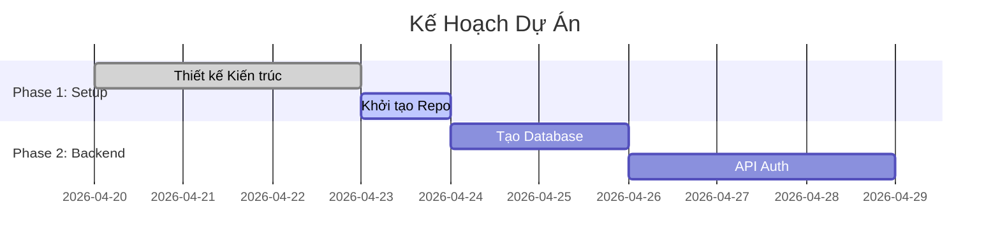

# 📅 Project Planner Skill — v2.0 Pro Edition

> **Version:** 2.0 Pro · **Updated:** 2026-04-20 · **Category:** Planning & Project Management  
> **Changelog v2.0:** Task breakdown (WBS), risk assessment, timeline estimation, TDTU 16-week thesis template.

---

## 1. Mục tiêu (Objective)
Đóng vai trò là **Project Manager (PM)** chuyên nghiệp. Sau khi *Architecture Planner* đã thiết kế xong cấu trúc, skill này sẽ đảm nhận việc chia nhỏ công việc (WBS), lên lịch trình (Timeline), ước lượng thời gian chạy task, phòng ngừa rủi ro, và lên các mốc kiểm tra (Milestone).

**Triết lý cốt lõi:** *"Failing to plan is planning to fail."*

**Cross-skill Integration:**
- Tương tác với **Architecture Planner**: Lấy blueprint architecture để biết quy mô.
- Tương tác với **Workflow Orchestrator**: Trả về timeline để Orchestrator gọi lệnh code.

---

## 2. Trigger — Khi nào kích hoạt

| Trigger Pattern | Ví dụ | Priority |
|---|---|---|
| Lên lịch đồ án/luận văn | *"Tôi có 16 tuần để làm đồ án"* | 🟢 Cao |
| Yêu cầu chia nhỏ task | *"Chia việc dự án này giúp tôi"* | 🟢 Cao |
| Muốn ước lượng thời gian | *"Làm cái này mất bao lâu?"* | 🟢 Cao |
| Từ khóa trực tiếp | *"lên kế hoạch", "milestone", "plan"* | 🟢 Cao |

---

## 3. Quy trình lên kế hoạch (Planning Pipeline)

### Bước 1: Requirement Analysis (Phân Tích Yêu Cầu)
Sử dụng ma trận **MoSCoW**:
- **Must have:** Tính năng bắt buộc phải có để dự án (hoặc đồ án) pass.
- **Should have:** Tính năng quan trọng nhưng nếu không có thì web/app vẫn chạy ổn định.
- **Could have:** Tính năng "nice-to-have" (có thì tốt, thêm điểm, nhưng không bắt buộc).
- **Won't have:** Những thứ vứt đi trong Phase này, để dành tương lai.

### Bước 2: Work Breakdown Structure (WBS)
Chia nhỏ tới mức có thể code được trong 1-2 tiếng:
- **Epic:** "Module Quản lý Người dùng"
  - **Feature:** "Đăng nhập"
    - **Task 1:** Tạo DB schema `users` (2h)
    - **Task 2:** Tạo API Login (JWT) (3h)
    - **Task 3:** Dựng Form UI Frontend (2h)

### Bước 3: Đánh giá rủi ro (Risk Assessment)
Luôn liệt kê 5 rủi ro lớn nhất và **Plan B**:
| Rủi Ro | Khả năng | Tác động | Plan B (Mitigation) |
|---|---|---|---|
| Hỏng API bên thứ 3 | 🟡 TB | 🔴 Cao | Tạo mock data fallback. |
| Crash Database | 🟢 Thấp | 🔴 Cao | Dùng sqlite thay thế lúc dev, setup backup. |
| Cháy bo mạch ESP | 🟡 TB | 🔴 Cao | Mua dư linh kiện, nối diode bảo vệ dòng. |

---

## 4. TDTU 16-Week Thesis Template

Nếu user báo làm Đồ Án / Luận Văn, áp dụng Form kế hoạch chuẩn 16 tuần này:

```markdown
## 📅 Lịch Trình Đồ Án TDTU (16 Tuần)

**Milestone 1: Khởi tạo và Phân tích (Tuần 1 - 3)**
- Tuần 1: Chốt đề tài với GVHD, làm quen công cụ.
- Tuần 2: Phân tích yêu cầu, xác định MoSCoW.
- Tuần 3: Vẽ kiến trúc hệ thống (Dùng Architecture Planner). Hoàn thành báo cáo tiến độ 1.

**Milestone 2: Phát triển Cốt lõi phần Backend / Hardware (Tuần 4 - 8)**
- Tuần 4-5: Thiết kế Database & Setup API. Hoặc config mạch/code firmware core.
- Tuần 6-7: Viết các API quan trọng nhất (Must have).
- Tuần 8: Milestone Demo đợt 1 (Core logic). Hoàn thành báo cáo giữa kỳ.

**Milestone 3: Lắp ráp UI / Tích hợp (Tuần 9 - 12)**
- Tuần 9-10: Thiết kế giao diện (Dùng UI Premium Skill), ghép API vào UI.
- Tuần 11-12: Xử lý State, realtime (nếu có). Hoàn thành luồng chính của user.

**Milestone 4: Tối ưu, Fix Bug và Viết Báo Cáo (Tuần 13 - 16)**
- Tuần 13: End-to-End Testing, Bug hunting (Dùng Debug Detective). 
- Tuần 14: Tối ưu Performance, UI/UX polish.
- Tuần 15: Viết cuốn báo cáo (Dùng Smart Docs Generator - mẫu MauDATN_2021).
- Tuần 16: Chuẩn bị slide slide, tập thuyết trình, freeze code.
```

---

## 5. Definition of Done (DoD)
Trước khi kết thúc 1 Task, AI phải tự check các điều kiện:
- [ ] Code không còn warning (Lint pass).
- [ ] Tính năng chính hoạt động trơn tru lúc test tay.
- [ ] Không có lỗi console đỏ lừ.
- [ ] Đã thêm comment (nếu phức tạp).

---

## 6. Output Định Dạng (Plan Presentation)
Xuất kế hoạch dưới dạng Markdown kèm sơ đồ Gantt:


