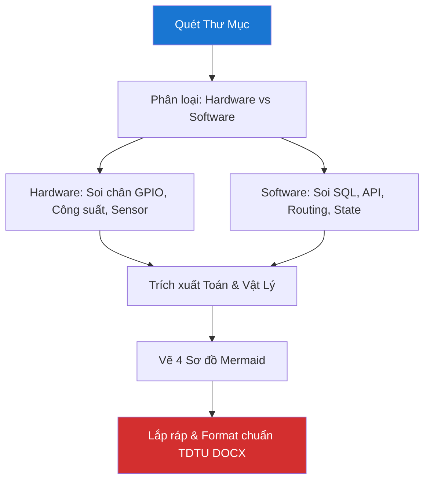

# 🔬 Deep Research & Thesis Generator Skill — v1.0 Pro

> **Version:** 1.0 Pro · **Updated:** 2026-04-20 · **Category:** Deep Analysis & Documentation  
> **Tính năng:** Quét 100% source code, trích xuất cấu trúc phần cứng/phần mềm, phát sinh phương trình toán/vật lý, tự động vẽ 4 sơ đồ (Mermaid), và sinh format DOCX chuẩn TDTU MauDATN_2021.

---

## 1. Mục tiêu (Objective)
Đóng vai trò là **Nghiên cứu sinh & Chuyên gia Báo cáo luận văn**. 
Phân tích *chiều sâu* toàn bộ dự án thay vì chỉ đọc qua loa. Hiểu tường tận từ mạch điện, linh kiện, công suất đến thuật toán phần mềm. Cuối cùng đóng gói mớ kiến thức đó thành một file Báo Cáo / Luận Văn cực kỳ bài bản theo đúng quy chuẩn format để thầy giáo chấm điểm "A+".

**Triết lý cốt lõi:** *"Không chỉ báo cáo cái gì đã làm, mà phải chứng minh hiểu sâu TẠI SAO lại làm như vậy."*

---

## 2. Trigger — Khi nào kích hoạt

| Lời nói của User | Ngữ cảnh | Priority |
|---|---|---|
| *"viết cho tôi bài báo cáo chi tiết cho thầy xem"* | Chuẩn bị nộp đồ án/môn học | 🔴 Cao |
| *"mổ xẻ dự án này ra, tao đã học được gì"* | Rút kinh nghiệm dự án | 🔴 Cao |
| *"làm file docx gồm 4-5 sơ đồ"* | Cần file nộp ngay | 🔴 Cao |
| *"viết luận văn chuẩn format TDTU"* | Viết Thesis cấp Đại học | 🔴 Cao |

> ⚠️ **Lưu ý khác biệt với `skill_viet_docs.md`:** 
> Nếu user chỉ cần "viết README.md" hoặc "thêm chú thích code", hãy dùng `skill_viet_docs`. Nếu user cần nộp **file Word cho Giáo viên**, hãy dùng skill này!

---

## 3. Deep Research Pipeline (Quy trình Quét Sâu Dự Án)

Để hiểu được dự án, AI PHẢI MỞ VÀ ĐỌC HẾT CÁC FILE QUAN TRỌNG, không được lướt qua.



### Bước 1: Scan Source Code & BOM
- Liệt kê toàn bộ file và thư mục. Đọc nốt nội dung các file core (main.cpp, App.jsx, schema.sql, requirements.txt).
- Liệt kê BOM (Bill of Materials): Các linh kiện đã xài trên file schematic / logic.

### Bước 2: Tự Động Định Hình 4 Sơ Đồ Cốt Lõi
Dựa trên code quét được, sinh ra 4 sơ đồ Mermaid bắt buộc phải có cho báo cáo:
1. **Sơ đồ khối hệ thống (Block Diagram):** Box-to-box nối liền hardware và cloud.
2. **Sơ đồ mạch logic / Sơ đồ kết nối:** Mapping các chân MCU (12, 14, 15...).
3. **Sơ đồ hoạt động (Flowchart):** User nhấn nút -> Hệ thống làm gì.
4. **Sơ đồ trình tự (Sequence Diagram):** Client gọi API -> DB trả data -> Update UI.

### Bước 3: Đào bới Công thức (Toán, Lý, Điện)
Thầy giáo rất thích nhìn thấy Toán. AI phải tự suy luận ra từ code:
- *Ví dụ Code có Delay xoay Servo:* Suy ra phương trình T (chu kỳ) của xung PWM 50Hz, tính góc quay $\alpha = f(t_{high})$.
- *Ví dụ Code có trở kéo (Pull-up):* Dẫn chứng tại sao $R = 10k\Omega$, công thức dòng chảy $I = V/R$ bảo vệ chống nhiễu loạn.
- *Ví dụ Code Motor:* Đưa công suất $P=U \times I$ để giải thích tại sao phải dùng Module L298N thay vì nối thẳng vô Arduino.

---

## 4. Format Chuẩn DOCX Luận Văn TDTU

Khi xuất văn bản, yêu cầu AI cung cấp Template hoặc hướng dẫn tạo file với quy chuẩn sau (dựa trên **MauDATN_2021 TDTU**).

### 4.1 Quy tắc Trình bày Layout (Áp dụng nếu render qua python-docx)
- **Cỡ chữ:** 13pt (Toàn bài). Font: **Times New Roman**.
- **Giãn dòng:** 1.5 lines.
- **Lề (Margins):** Trên/Dưới/Phải: 2cm, Trái: 3cm.
- **Căn lề (Alignment):** Justify (Canh đều 2 bên).
- **Đánh số trang:** Ở giữa (Center), lề dưới. Từ phần Mở đầu mới bắt đầu đếm 1, 2, 3.

### 4.2 Quy tắc Đánh Heading
- **Chương:** `CHƯƠNG 1: TỔNG QUAN` (IN HOA, Bold, 14pt, Căn giữa).
- **Mục Cấp 1:** `1.1. Mục tiêu đề tài` (Bold, 13pt).
- **Mục Cấp 2:** `1.1.1. Mục tiêu cụ thể` (Bold, nghiêng, 13pt).

### 4.3 Quy tắc Hình ảnh & Bảng biểu
- Luôn để placeholder ảnh kèm chú thích chuẩn TDTU:
- *Ví dụ Ảnh:* Chèn `<Kẻ khung chứa ảnh ở đây>` ➔ Chú thích bên dưới: `Hình 1.1: Sơ đồ khối hệ thống` (In nghiêng, 12pt, Căn giữa).
- *Ví dụ Bảng:* Chú thích nằm BÊN TRÊN bảng: `Bảng 2.1: Danh sách linh kiện` (In nghiêng, 12pt, Căn ngang).

---

## 5. Mẫu Nội Dung Báo Cáo (5 Chương Chi Tiết)

Nội dung AI sinh ra phải tuân thủ khung sườn siêu chi tiết này, đổ kiến thức tự quét được vào các lỗ hổng.

```markdown
# [TÊN ĐỀ TÀI DỰ ÁN]
**Họ và tên SV:** [Tên] | **MSSV:** [Mã số]

## CHƯƠNG 1: TỔNG QUAN
### 1.1 Khái quát về đề tài
Trình bày hiện trạng thực tế. Tại sao lại chọn đề tài này? [Viết học thuật 2-3 đoạn].
### 1.2 Mục tiêu nghiên cứu
- Thiết kế mạch cứng điều khiển [X].
- Xây dựng phần mềm tương tác [Y].
### 1.3 Phạm vi và Đối tượng
Hệ thống thử nghiệm trong phạm vi hẹp. Tập trung vào vi điều khiển [ESP32/Arduino/NodeJS].

## CHƯƠNG 2: CƠ SỞ LÝ THUYẾT & LINH KIỆN
### 2.1 Các giao thức sử dụng
- **Giao thức MQTT / HTTP / I2C:** Trình bày lý thuyết hoạt động, tốc độ baud rate, dải tần. [Dẫn chứng từ Source Code].
### 2.2 Các linh kiện / Công nghệ phần mềm
- Lập bảng **Bảng 2.1: Danh sách phần cứng/phần mềm**.
- Nếu phần cứng: Liệt kê MCU, Sensor, Driver. Mô tả Datasheet, cấp điện áp (VD: 3.3V vs 5V logic level).
- Nếu phần mềm: Giới thiệu thư viện (React, Express, FastAPI).
### 2.3 Cơ sở toán học và Động lực học
Trình bày công thức. Ví dụ:
- Công thức điện: Tính chọn điện trở kéo lên bảo vệ nút nhấn $R = \frac{V_{cc} - V_{IH}}{I_{IH}} \approx 10k\Omega$.
- Tần số PWM cho Servo [trích xuất từ code ledcSetup].

## CHƯƠNG 3: THIẾT KẾ VÀ THI CÔNG HỆ THỐNG
### 3.1 Sơ đồ khối tổng thể
[Chèn Mermaid Diagram Sơ đồ khối]
*Hình 3.1: Sơ đồ khối hệ thống*
### 3.2 Thiết kế chi tiết phần cứng / cơ sở dữ liệu
- Sơ đồ nối dây (Pin mapping: GPIO 15 nối vô Servo, D2 nối đèn báo...).
- Sơ đồ ERD DataBase [Chèn Mermaid ERD].
*Hình 3.2: Sơ đồ kết nối mạch vật lý*
### 3.3 Thiết kế lưu đồ thuật toán chính
[Chèn Mermaid Flowchart của luồng chạy chính (VD: Đọc thẻ RFID -> Check DB -> Xoay cửa)]
*Hình 3.3: Lưu đồ hoạt động.*
### 3.4 Thiết kế Tương tác (Phần Cứng ↔ Phần Mềm)
[Chèn Mermaid Sequence Diagram]
*Hình 3.4: Sơ đồ tương tác API và Hardware*

## CHƯƠNG 4: THỰC NGHIỆM VÀ ĐÁNH GIÁ KẾT QUẢ
### 4.1 Quy trình thực nghiệm
Hình chụp mạch thật / Screenshot web. <Chừa chỗ dể người dùng chèn ảnh thực tế>.
*Hình 4.1: Hình ảnh thực tế hệ thống.*
### 4.2 Các kết quả đạt được
Chứng minh hệ thống chạy đúng yêu cầu Chương 1. Thời gian phản hồi bao nhiêu giây? Đạt độ trễ Real-time không?
### 4.3 Những lỗi thường gặp và cách khắc phục
Đào bới lại trong code những comment `// FIX` hoặc `// TODO` để liệt kê các vấn đề kỹ thuật từng gặp (VD: Lắp ngược nguồn, lỗi CORS, tràn RAM ESP32). Cách nối thêm tụ điện filter nhiễu ở nguồn 5V.

## CHƯƠNG 5: KẾT LUẬN & HƯỚNG PHÁT TRIỂN
### 5.1 Kết luận
Luận văn đã làm được [A, B, C]. Nắm vững kiến thức [Toán, Lý, Code].
### 5.2 Hướng phát triển
Tương lai có thể tích hợp AI, mở rộng server chịu tải 1 vạn user...
```

---

## 6. Trình Tạo DOCX Bằng Python (DOCX Generator)
Vì AI không xuất được file DOCX trực tiếp từ khung chat, hãy đưa cho user đoạn Code Python này. Đoạn code này dùng `python-docx` để tạo báo cáo **TUYỆT ĐỐI CHUẨN FORMAT TDTU**. User chỉ cần chạy script. Có thể xuất HTML báo cáo markdown ra Word.

```python
# Tự động chèn Python snippet này cung cấp cho user khi họ đòi file "docx" thật sự.
from docx import Document
from docx.shared import Pt, Cm, Inches
from docx.enum.text import WD_ALIGN_PARAGRAPH
from docx.oxml.ns import qn

def tao_bao_cao_tdtu(file_name="Bao_Cao_TDTU.docx"):
    doc = Document()
    
    # 1. SETUP PAGE MARGINS TDTU
    sections = doc.sections
    for section in sections:
        section.top_margin = Cm(2)
        section.bottom_margin = Cm(2)
        section.left_margin = Cm(3)
        section.right_margin = Cm(2)
        
    # 2. SETUP STYLES TDTU
    style = doc.styles['Normal']
    font = style.font
    font.name = 'Times New Roman'
    font.size = Pt(13)
    p_format = style.paragraph_format
    p_format.line_spacing = 1.5
    p_format.alignment = WD_ALIGN_PARAGRAPH.JUSTIFY

    # 3. ADD CONTENT
    doc.add_heading('CHƯƠNG 1: TỔNG QUAN', level=1)
    
    # Demo paragraph
    p = doc.add_paragraph('Thay nội dung Markdown do AI xuất vào các hàm tạo văn bản này. Ví dụ: Thiết kế mạch...')
    
    doc.save(file_name)
    print(f"✅ Đã xuất file {file_name} chuẩn format TDTU với margin 3x2x2x2!")

if __name__ == "__main__":
    tao_bao_cao_tdtu()
```

---

## 7. Adaptive Behavior (Tự Thích Nghi)

| Đặc Điểm Code Quét Được | Phản Xạ của AI (Format Shift) |
|---|---|
| Chứa `platformio.ini`, `include <WiFi.h>`, `digitalWrite` | Báo cáo theo hướng **Đồ án Nhúng / IoT / Điện Tử**. Tập trung vào Schematic, Pinout, PWM, I2C, Rơ-le, Công suất điện. |
| Chứa `react`, `tailwind`, `express`, `postgres` | Báo cáo hướng **Công Nghệ Phần Mềm**. Tập trung ERD, Cấu trúc Component, Sequence Flow xác thực, RESTful API. |
| Chứa `tensorflow`, `pandas`, `scikit-learn` | Báo cáo hướng **Trí Tuệ Nhân Tạo / AI**. Bắt buộc có công thức Mạng Neural, Toán Ma trận, Đồ thị loss function, Confusion Matrix. |
| Yêu cầu làm gấp trong đêm | Kích hoạt Panic Mode: Viết dàn ý rất ngắn gọn, đập liền 4 cái ảnh Mermaid vào cho Report dày lên, bỏ qua chứng minh toán học phức tạp. |
