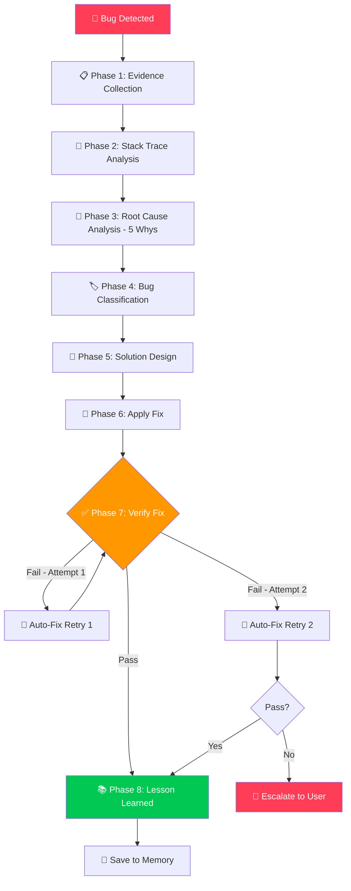
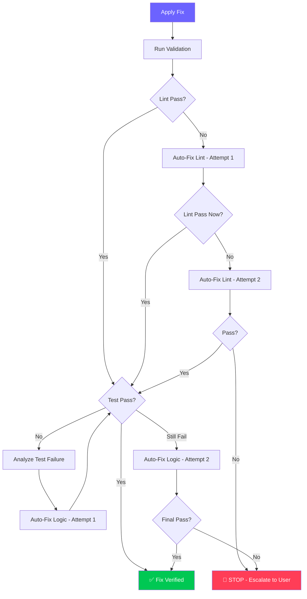

# 🔍 Debug Detective Skill — v2.0 Pro Edition

> **Version:** 2.0 Pro · **Updated:** 2026-04-19 · **Category:** Debugging & Troubleshooting  
> **Changelog v2.0:** Stack trace analyzer, auto-fix pipeline (max 2 retries), pattern database, Mermaid investigation flow, cross-language quick-ref, regression guard, memory integration for recurring bugs.

---

## 1. Mục tiêu (Objective)
Khi gặp lỗi, skill này biến AI thành một **thám tử debug chuyên nghiệp** — phân tích root cause có hệ thống, đề xuất fix chính xác, tự verify fix, ghi nhớ bài học để không mắc lại, và tích hợp auto-fix pipeline theo quy tắc "sửa tối đa 2 lần trước khi hỏi user".

**Triết lý:** *"Đừng đoán. Hãy điều tra."* — Mỗi bug đều có dấu vết, chỉ cần biết cách đọc.

**Cross-skill Integration:**
- Sau khi fix → **Code Review** tự review fix có tạo code smell mới không
- Pattern bug lặp lại → **Memory** lưu vào project knowledge
- Fix cần refactor lớn → **Architecture Planner** lên kế hoạch trước

---

## 2. Trigger — Khi nào kích hoạt

| Trigger Pattern | Ví dụ | Priority |
|---|---|---|
| User paste error/stack trace | *"bị lỗi này: TypeError..."* | 🔴 Cao nhất |
| Build/compile fail | *"npm run build bị lỗi"*, *"compile error"* | 🔴 Cao nhất |
| Auto-validation fail | Lint/test fail sau khi edit code | 🔴 Cao nhất |
| User mô tả bug behavior | *"app chạy nhưng data không hiện"* | 🟡 Cao |
| Hành vi bất thường | *"sao click nút mà không có gì xảy ra?"* | 🟡 Cao |
| Từ khóa debug | *"debug:", "fix:", "tại sao bị:", "lỗi:"* | 🟡 Cao |
| Performance issue | *"app chạy chậm"*, *"lag quá"* | 🟢 Trung bình |
| Warning messages | *"có warning trong console"* | 🟢 Trung bình |

---

## 3. Investigation Pipeline — Quy trình điều tra



### Phase 1: 📋 Evidence Collection (Thu thập bằng chứng)

TRƯỚC KHI suy đoán, PHẢI thu thập đầy đủ:

```markdown
## 📋 Bug Report Card

**🐛 Triệu chứng:** [Mô tả chính xác hiện tượng user thấy]
**📍 Vị trí:** [File, line number, component]
**🔄 Steps to Reproduce:**
  1. [Step 1]
  2. [Step 2]
  3. [→ Lỗi xảy ra]
**📝 Error Message:** [Nguyên văn + stack trace]
**🕐 Timing:** [Luôn lỗi? Intermittent? Mới xuất hiện?]
**💻 Environment:** [OS, Browser, Node/Python version, Framework version]
**🔀 Recent Changes:** [Git diff, file nào vừa sửa?]
**📎 Related:** [Screenshot, console output, network tab]
```

**Smart Evidence Gathering:**
- Tự động chạy `grep_search` tìm file/line liên quan
- Đọc error message → parse ra file path + line number → đọc context xung quanh
- Kiểm tra git history nếu "trước đó chạy đúng"

### Phase 2: 🧠 Stack Trace Analyzer

Khi user paste stack trace, tự động parse:

```
Input: 
  TypeError: Cannot read properties of undefined (reading 'map')
    at Dashboard (src/pages/Dashboard.tsx:42:18)
    at renderWithHooks (node_modules/react-dom/...)
    at mountIndeterminateComponent (node_modules/react-dom/...)

Analysis:
┌─────────────────────────────────────────────┐
│ Error Type:  TypeError (Runtime)             │
│ Location:    src/pages/Dashboard.tsx:42       │
│ Property:    'map' on undefined              │
│ Call Chain:  React render → Dashboard → L42  │
│ Category:    Null Reference in Render         │
│ Pattern:     UNGUARDED_ASYNC_RENDER           │
└─────────────────────────────────────────────┘

Immediate Action: Read Dashboard.tsx lines 35-50
```

**Parse Rules:**
1. Bỏ qua tất cả lines chứa `node_modules/` — đó là framework internals
2. Focus vào line ĐẦU TIÊN trong user code (không phải library code)
3. Extract: file path, line number, error type, property name
4. Map error type → known pattern (xem Pattern Database bên dưới)

### Phase 3: 🔬 Root Cause Analysis — 5 Whys

Áp dụng **5 Whys** có hệ thống:

```
🐛 Lỗi: TypeError: Cannot read property 'map' of undefined

Why 1: Tại sao 'map' fail?
  → Vì biến 'transactions' là undefined tại thời điểm render

Why 2: Tại sao 'transactions' undefined?  
  → Vì useEffect fetch data chưa resolve khi component render lần đầu

Why 3: Tại sao render trước khi data sẵn sàng?
  → Vì không có loading state guard trong JSX

Why 4: Tại sao không có loading guard?
  → Vì developer quên handle initial state của async data

Why 5 (ROOT CAUSE): 
  → Thiếu initial state pattern: loading=true + data=[] + error=null
  → Pattern name: UNGUARDED_ASYNC_RENDER
```

**5 Whys Rules:**
- Mỗi "Why" phải dựa trên BẰNG CHỨNG (code, log, behavior), không đoán
- Dừng khi tìm được **actionable root cause** (có thể viết code fix được)
- Nếu sau 5 Whys vẫn chưa rõ → cần thêm evidence → hỏi user

### Phase 4: 🏷️ Bug Classification Matrix

| Category | Sub-type | Dấu hiệu | Severity | Typical Fix Time |
|---|---|---|---|---|
| **Syntax** | Parse error | Lỗi compile, red underline | 🟢 Low | < 1 min |
| **Syntax** | Type mismatch | TypeScript error | 🟢 Low | < 5 min |
| **Runtime** | Null reference | `undefined`, `null` errors | 🟡 Medium | 5-15 min |
| **Runtime** | Type coercion | Unexpected type at runtime | 🟡 Medium | 5-15 min |
| **Logic** | Wrong output | Code runs but result incorrect | 🟠 Medium-High | 15-60 min |
| **Logic** | Off-by-one | Loop/index boundary error | 🟡 Medium | 5-15 min |
| **Async** | Race condition | Intermittent, timing-dependent | 🔴 High | 30-120 min |
| **Async** | Unhandled promise | Promise rejection without catch | 🟡 Medium | 5-15 min |
| **Async** | Stale closure | Callback uses old state value | 🟠 Medium-High | 15-30 min |
| **State** | Stale state | UI doesn't update | 🟡 Medium | 10-30 min |
| **State** | State desync | Multiple sources of truth | 🔴 High | 30-120 min |
| **Integration** | CORS | Cross-origin request blocked | 🟡 Medium | 5-15 min |
| **Integration** | API contract | Response shape doesn't match | 🟡 Medium | 10-30 min |
| **Integration** | Auth failure | 401/403 errors | 🟡 Medium | 5-30 min |
| **Environment** | Dependency | Missing/wrong package version | 🟢 Low | 5-15 min |
| **Environment** | Config | Wrong env vars, paths | 🟢 Low | 5-15 min |
| **Performance** | Memory leak | RAM grows over time | 🔴 High | 30-120 min |
| **Performance** | Render loop | Infinite re-renders | 🟠 Medium-High | 15-30 min |
| **Hardware** | GPIO conflict | Pin not responding (ESP32) | 🟡 Medium | 10-30 min |
| **Hardware** | Power issue | Brownout, reset loops | 🟠 Medium-High | 15-60 min |
| **Hardware** | Communication | I2C/SPI/UART not working | 🟡 Medium | 15-60 min |

### Phase 5: 💊 Solution Design

Mỗi fix phải có cấu trúc:

```markdown
## 💊 Proposed Fix

**Pattern:** [UNGUARDED_ASYNC_RENDER]
**Root Cause:** Component renders trước khi async data sẵn sàng
**Confidence:** 🟢 Cao (95%)

**Strategy:** Thêm loading state + null guard + error boundary

**Changes Required:**

### Change 1: `src/pages/Dashboard.tsx` (Line 15-20)
Purpose: Thêm loading và error state
```diff
- const { transactions } = useTransactionStore();
+ const { transactions, loading, error } = useTransactionStore();
```

### Change 2: `src/pages/Dashboard.tsx` (Line 40-45)  
Purpose: Guard render với loading/error states
```diff
- return <div>{transactions.map(t => ...)}</div>
+ if (loading) return <LoadingSpinner />;
+ if (error) return <ErrorMessage error={error} />;
+ if (!transactions.length) return <EmptyState />;
+ return <div>{transactions.map(t => ...)}</div>
```

### Change 3: `src/stores/transactionStore.ts` (Line 8-12)
Purpose: Thêm loading/error vào store initial state
```diff
  const initialState = {
    transactions: [],
+   loading: true,
+   error: null as Error | null,
  };
```

**Side Effects:** None — changes are additive
**Regression Risk:** Low — only adds guards, doesn't change logic
```

### Phase 6: 🔧 Apply Fix & Auto-Fix Pipeline



**Auto-Fix Rules:**
```
Fixable Automatically (không cần hỏi user):
  ✅ Import missing/unused → auto add/remove
  ✅ Formatting/whitespace → auto format
  ✅ Missing semicolons → auto add
  ✅ Unused variables → auto remove
  ✅ Simple type annotations → auto add

Requires User Confirmation:
  ⚠️ Logic changes → trình bày diff, hỏi confirm
  ⚠️ API contract changes → có thể break other services
  ⚠️ State structure changes → có thể break dependent components
  ⚠️ Delete code → luôn hỏi trước

NEVER Auto-Fix:
  ❌ Security-related changes
  ❌ Database schema changes  
  ❌ Environment/config changes
  ❌ Anything affecting production data
```

### Phase 7: ✅ Verification Checklist

```markdown
□ Lỗi gốc đã biến mất?
□ Regression check: các test khác vẫn pass?
□ Edge cases đã xử lý?
  □ Empty/null input
  □ Boundary values (0, MAX_INT, empty string)
  □ Network timeout/error
  □ Concurrent operations
□ Lint pass? (`npm run lint` / `flake8` / PlatformIO check)
□ Type check pass? (`tsc --noEmit`)
□ UI hiển thị đúng? (nếu là UI bug)
□ Performance không bị regression? 
```

### Phase 8: 📚 Lesson Learned + Memory Save

```markdown
## 📚 Bug Pattern Recorded

**Pattern Name:** UNGUARDED_ASYNC_RENDER
**Language:** TypeScript / React
**Frequency:** Common (đã gặp X lần)

**Symptom:** TypeError: Cannot read property 'X' of undefined, xảy ra trong render
**Root Cause:** Async data chưa sẵn sàng khi component render lần đầu
**Prevention Rule:** 
  → Mọi async data PHẢI có 3 states: loading, data, error
  → LUÔN guard render: if (loading) return <Loading/>

**Quick Fix Template:**
```typescript
const { data, loading, error } = useAsyncData();
if (loading) return <LoadingSpinner />;
if (error) return <ErrorMessage error={error} />;
if (!data) return <EmptyState />;
// Safe to use data here
```

→ 💾 Lưu vào project memory? [Y/n]
```

---

## 4. Pattern Database — Bảng tra cứu nhanh

### 🟡 JavaScript / TypeScript

| Error Pattern | Root Cause | Quick Fix |
|---|---|---|
| `Cannot read property 'x' of undefined` | Object chưa init / API chưa trả về | `obj?.x` + loading guard |
| `Cannot read property 'x' of null` | Explicit null (API trả null) | `obj?.x ?? defaultValue` |
| `x is not a function` | Import sai / value bị overwrite | Check import, check assignment chain |
| `Maximum call stack exceeded` | Infinite recursion / useEffect loop | Add base case / fix dependency array |
| `Cannot assign to 'x' because it is a constant` | Reassign const | Dùng let, hoặc mutate object property |
| `Unexpected token` | Syntax error, thường thiếu bracket/paren | Check bracket matching |
| `Module not found: Can't resolve 'x'` | Sai path hoặc chưa install | `npm install x` hoặc fix path |
| `CORS error` | Backend không allow origin | Server-side: add Access-Control-Allow-Origin |
| `Hydration mismatch` (Next.js/SSR) | Server HTML ≠ Client HTML | Dùng `useEffect` cho dynamic content |
| `Too many re-renders` | setState trong render body | Move setState vào useEffect/event handler |
| `Can't perform state update on unmounted` | Async callback sau unmount | AbortController / cleanup in useEffect |
| `ResizeObserver loop limit exceeded` | Observer triggers layout loop | Debounce observer callback |
| `ChunkLoadError` | Lazy-loaded chunk failed | Retry logic + fallback UI |

### 🐍 Python

| Error Pattern | Root Cause | Quick Fix |
|---|---|---|
| `IndentationError` | Mix tabs & spaces | Chuẩn hóa 4 spaces, dùng editor setting |
| `ImportError` / `ModuleNotFoundError` | Chưa install hoặc sai venv | `pip install x` + check venv activated |
| `KeyError: 'x'` | Dict key không tồn tại | `dict.get('x', default)` |
| `TypeError: 'NoneType' object` | Function return None unexpectedly | Add null check, check function return |
| `FileNotFoundError` | Sai path hoặc CWD khác expected | `Path(__file__).parent / 'file.txt'` |
| `UnicodeDecodeError` | File encoding khác UTF-8 | `open(f, encoding='utf-8', errors='replace')` |
| `RecursionError` | Infinite recursion | Add base case, check recursive call args |
| `MemoryError` | Dataset quá lớn | Generator/chunked processing |
| `AttributeError` | Object không có attribute | Check type, add hasattr guard |
| `ValueError: too many values to unpack` | Tuple/list size mismatch | Check data shape before unpacking |

### 🔧 ESP32 / Arduino (C/C++)

| Error Pattern | Root Cause | Quick Fix |
|---|---|---|
| `Guru Meditation Error: Core X panic` | Stack overflow / null pointer / watchdog | Tăng stack size (8192+), check pointers |
| `Brownout detector was triggered` | Nguồn không đủ dòng | Dùng nguồn 2A+, thêm tụ 100µF |
| `GPIO X won't work` | Strapping pin / flash pin conflict | Kiểm tra [datasheet](https://docs.espressif.com/), dùng safe pins |
| `Upload failed: Timed out` | Wrong board / driver / boot mode | Check COM port, hold BOOT button |
| `E (XXX) wifi: ... NVS fail` | NVS partition corrupted | Erase flash: `pio run -t erase` |
| `Task watchdog got triggered` | Task blocking quá lâu | Thêm `vTaskDelay()`, giảm blocking time |
| `I2C: ACK error` | Sai address / wiring / pull-up missing | Check address (I2C scanner), add 4.7kΩ pull-ups |
| `SPI: No response` | MISO/MOSI swap / CS not driven | Double-check wiring, verify CS pin toggle |
| `assert failed: ... IRAM` | Code/data không fit trong IRAM | Giảm IRAM usage, dùng DRAM attributes |
| `Heap overflow` | Quá nhiều dynamic allocation | Dùng static allocation, giảm buffer sizes |

### 🎨 CSS / UI

| Bug Pattern | Root Cause | Quick Fix |
|---|---|---|
| Element không hiển thị | `display:none`, `opacity:0`, z-index bị che, overflow:hidden | Inspect computed styles, check parent overflow |
| Layout bể responsive | Fixed width, not using responsive units | `%`, `vw/vh`, `clamp()`, flex/grid |
| Animation giật | Animating layout properties | Chỉ animate `transform` + `opacity`, dùng `will-change` |
| Font không load | Path sai / CORS block | Dùng Google Fonts CDN, check path |
| Gap giữa inline elements | Whitespace trong HTML | `font-size:0` on parent, hoặc flex |
| Sticky not working | Parent has `overflow:hidden` | Remove overflow hidden from ancestors |
| Hover flicker | Element repositions on hover | Dùng `transform` thay vì `margin`/`top` |
| Dark mode inconsistent | Hard-coded colors | Dùng CSS custom properties |

---

## 5. Debug Strategies — Chiến lược nâng cao

### 5.1 — Binary Search Debug (Chia đôi tìm lỗi)
```
Khi lỗi ở đâu đó trong 100 dòng code:
1. Comment out nửa dưới (line 50-100)
2. Chạy lại → Còn lỗi? → Lỗi ở nửa trên (1-50)
3. Comment out nửa dưới của nửa trên (line 25-50)  
4. Lặp lại → 6-7 lần là tìm ra dòng chính xác
⏱️ O(log n) thay vì O(n) — nhanh gấp 10x
```

### 5.2 — Delta Debug (Git bisect)
```bash
# Khi bug mới xuất hiện và trước đó code chạy đúng:
git bisect start
git bisect bad              # commit hiện tại lỗi
git bisect good abc123      # commit chạy đúng gần nhất
# Git sẽ checkout giữa → test → tiếp tục bisect
# → Tìm ra CHÍNH XÁC commit nào introduce bug
```

### 5.3 — Isolation Debug (Tách riêng test)
```
Nghi function X bị lỗi?
1. Tạo file test riêng (scratch file)
2. Import chỉ function X
3. Gọi với input đã biết → kiểm tra output
4. Nếu output đúng → lỗi ở nơi khác (integration)
5. Nếu output sai → lỗi ở function X → debug trong isolation
```

### 5.4 — Breadcrumb Trail (Dấu vết console)
```javascript
// Đặt console.log có EMOJI + INDEX tại các checkpoint:
console.log('🔵 [1] Function called, args:', { userId, amount });
console.log('🟡 [2] After validation:', { isValid, errors });
console.log('🟢 [3] API response:', { status, data });
console.log('🔴 [4] State update:', { before: oldState, after: newState });
console.log('⭐ [5] Render with:', { items: items.length, loading });

// → Theo dõi data flow: tìm điểm data "biến mất" hoặc "biến dạng"
// → SAU KHI FIX: xóa tất cả debug logs!
```

### 5.5 — Rubber Duck Debug (Giải thích cho vịt)
```
Khi stuck > 15 phút:
1. Mở file có bug
2. Giải thích TỪNG DÒNG cho "con vịt" (tức là diễn đạt bằng lời)
3. "Dòng 42: tôi gọi map trên transactions..."
4. "Khoan... transactions lúc này là gì nhỉ? Có undefined không?"
5. → Lỗi thường LỘ RA khi phải giải thích logic
```

### 5.6 — Minimal Reproduction (Tái tạo tối giản)
```
Khi bug phức tạp, khó debug trong full app:
1. Tạo project mới completly empty
2. Thêm TỪNG phần code liên quan (1 lần 1 file)
3. Sau mỗi lần thêm → test
4. Khi bug xuất hiện → file vừa thêm chứa bug
5. Bonus: minimal repro có thể share để hỏi người khác
```

---

## 6. Performance Debugging Toolkit

### Memory Leak Detection
```javascript
// Browser DevTools → Memory tab → Heap Snapshot
// Take snapshot → Do suspicious action → Take another snapshot
// Compare: objects that grew = potential leak

// Common leaks:
// 1. Event listeners not removed
useEffect(() => {
  window.addEventListener('resize', handler);
  return () => window.removeEventListener('resize', handler); // ← cleanup!
}, []);

// 2. setInterval not cleared
useEffect(() => {
  const id = setInterval(tick, 1000);
  return () => clearInterval(id); // ← cleanup!
}, []);

// 3. AbortController for fetch
useEffect(() => {
  const controller = new AbortController();
  fetch(url, { signal: controller.signal }).then(setData);
  return () => controller.abort(); // ← cleanup!
}, [url]);
```

### Render Performance
```javascript
// React DevTools → Profiler → Record → Do action → Stop
// Look for:
// - Components rendering too often (yellow/red)
// - Components rendering when props didn't change → add React.memo
// - Expensive calculations in render → useMemo

// Quick fix: React.memo wrapper
const ExpensiveList = React.memo(({ items }) => (
  <ul>{items.map(i => <li key={i.id}>{i.name}</li>)}</ul>
));
```

---

## 7. Output Format — Debug Report

```markdown
## 🔍 Debug Report — [Tên bug ngắn gọn]

| Metadata | Value |
|---|---|
| **⏱️ Time to diagnose** | [X phút] |
| **🏷️ Category** | [Runtime / Logic / Async / ...] |
| **🎯 Confidence** | [🟢 Cao / 🟡 Trung bình / 🔴 Thấp] |
| **📍 Location** | [file:line] |
| **🔄 Auto-fix attempts** | [0/1/2] |

### 🐛 Symptom
[1-2 câu mô tả hiện tượng]

### 🔬 Root Cause (5 Whys)
[Chain analysis with evidence]

### 💊 Fix Applied
```diff
[Changes in diff format]
```

### ✅ Verification
- [x] Error resolved  
- [x] No regression
- [x] Lint pass
- [x] Edge cases handled

### 📚 Prevention
> **Rule:** [1 câu: làm sao phòng tránh]
> **Pattern:** [Pattern name for future reference]

### 💾 Save to Memory?
[Suggest saving if this is a new/important pattern]
```

---

## 8. Adaptive Behavior

| Context | Behavior |
|---|---|
| Error có stack trace | Tự parse → focus vào user code lines |
| Error KHÔNG có stack trace | Hỏi user reproduce steps, hoặc thêm debug logs |
| Lỗi giống pattern đã gặp (memory) | Nhắc "bug này giống [pattern X] đã gặp trước" |
| User paste screenshot (not text) | Đọc screenshot, extract error text |
| ESP32/hardware bug | Check GPIO conflict table, kiểm tra power supply |
| Bug intermittent (không ổn định) | Gợi ý race condition, timing issue, add retry logic |
| User nói "deploy bị lỗi, local ok" | Focus env vars, build config, CORS, API URLs |
| User frustrated (đã stuck lâu) | Gợi ý Rubber Duck method, hoặc hỏi minimal repro |
