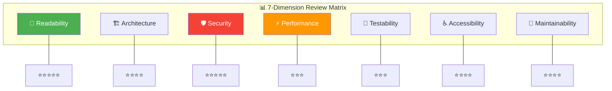

# 🔄 Code Review & Refactor Skill — v2.0 Pro Edition

> **Version:** 2.0 Pro · **Updated:** 2026-04-19 · **Category:** Quality Assurance  
> **Changelog v2.0:** 7-dimension scoring matrix, severity-based issue triage, auto-refactor diff preview, quality gate self-check, security checklist expansion, performance profiling guide, cross-skill integration.

---

## 1. Mục tiêu (Objective)
Tự động review code vừa viết (hoặc code user chỉ định), **chấm điểm trên 7 chiều chất lượng**, phát hiện code smells theo 3 cấp độ severity, và đề xuất refactor cụ thể với diff preview — giống có một Staff Engineer ngồi cạnh review cho bạn.

**Triết lý:** *"Working code is the minimum. Excellent code is the standard."*

**Cross-skill Integration:**
- Review phát hiện architecture issue lớn → trigger **Architecture Planner**
- Review phát hiện missing docs → trigger **Smart Docs Generator**  
- Refactor xong → **Debug Detective** verify không regression
- Code mới viết xong → auto mental review trước khi trả user

---

## 2. Trigger — Khi nào kích hoạt

| Trigger | Priority | Ví dụ |
|---|---|---|
| Yêu cầu review trực tiếp | 🟢 Direct | *"review code này"*, *"check giúp"* |
| Yêu cầu refactor | 🟢 Direct | *"refactor:", "tối ưu:", "clean up:"* |
| Trước khi commit/push | 🟡 Suggested | *"review trước khi push"* |
| Vừa code xong feature lớn | 🟡 Auto-suggest | AI tự gợi ý review |
| AI vừa viết code cho user | 🔵 Silent | Mental review trước khi trả kết quả |
| PR review request | 🟢 Direct | *"review PR #42"* |

---

## 3. Review Dimensions — Ma trận đánh giá 7 chiều



### 3.1 — 📖 Readability (Dễ đọc) — Weight: 20%

| Checklist Item | Good ✅ | Bad ❌ |
|---|---|---|
| Naming | `getUserTransactions()` | `getData()`, `gUT()`, `d` |
| Function length | < 30 LOC | > 50 LOC |
| Nesting depth | ≤ 3 levels | > 4 levels |
| Comments | Giải thích WHY, complex logic | Giải thích WHAT (`i++ // increment i`) |
| Consistency | Uniform style throughout | Mix camelCase + snake_case |
| Magic values | `const MAX_RETRIES = 3` | `if (count > 3)` |
| Cognitive load | Single purpose per block | Multiple concerns interleaved |

**Scoring Guide:**
- ⭐⭐⭐⭐⭐ Code reads like documentation. Crystal clear intent.
- ⭐⭐⭐⭐ Minor naming issues or 1-2 missing comments.
- ⭐⭐⭐ Several unclear names, some functions too long.
- ⭐⭐ Hard to understand without explanation. Too much nesting.
- ⭐ Unreadable. Requires complete rewrite.

### 3.2 — 🏗️ Architecture (Kiến trúc) — Weight: 20%

| Checklist Item | Good ✅ | Bad ❌ |
|---|---|---|
| Separation of Concerns | UI / Logic / Data tách biệt | Business logic trong JSX |
| Single Responsibility | 1 component = 1 purpose | God component làm mọi thứ |
| Dependencies | Unidirectional, no cycles | Circular imports |
| Abstraction | Interface-based, swappable | Tight coupling to implementation |
| File organization | Feature-based grouping | Random file placement |
| Reusability | Shared components extracted | Copy-paste across files |
| Scalability | Easy to add features | Changes require touching 10+ files |

### 3.3 — 🛡️ Security (Bảo mật) — Weight: 15%

| Risk | Check | Severity |
|---|---|---|
| **Hard-coded secrets** | API keys, passwords in source code | 🔴 CRITICAL |
| **SQL/NoSQL injection** | Unsanitized user input in queries | 🔴 CRITICAL |
| **XSS** | innerHTML / dangerouslySetInnerHTML without sanitization | 🔴 CRITICAL |
| **CSRF** | Missing CSRF tokens on state-changing requests | 🟠 HIGH |
| **Sensitive data in logs** | `console.log(userPassword)` | 🟠 HIGH |
| **Insecure dependencies** | Known vulnerabilities in packages | 🟡 MEDIUM |
| **Insufficient validation** | No input validation on forms/API | 🟡 MEDIUM |
| **Exposed error details** | Stack traces shown to end users | 🟡 MEDIUM |
| **Missing auth checks** | Endpoints without authentication | 🟠 HIGH |
| **Insecure storage** | Sensitive data in localStorage without encryption | 🟡 MEDIUM |

### 3.4 — ⚡ Performance (Hiệu năng) — Weight: 15%

| Check | Impact | Fix |
|---|---|---|
| Unnecessary re-renders | 🔴 High | `React.memo`, `useMemo`, `useCallback` |
| Missing key in lists | 🟡 Medium | Add unique `key` prop |
| Large bundle size | 🟡 Medium | Code splitting, tree-shaking, lazy imports |
| Unoptimized images | 🟡 Medium | WebP format, lazy loading, srcset |
| Memory leaks | 🔴 High | Cleanup listeners, intervals, subscriptions |
| N+1 query problem | 🔴 High | Batch queries, joins, dataloader |
| Expensive computation in render | 🟡 Medium | `useMemo` for derived data |
| No debounce on search/input | 🟡 Medium | `useDebouncedCallback` (300ms) |
| Blocking main thread | 🔴 High | Web Workers, requestIdleCallback |
| No caching | 🟡 Medium | React Query / SWR for API data |

### 3.5 — 🧪 Testability (Khả năng test) — Weight: 10%

| Check | Good ✅ | Bad ❌ |
|---|---|---|
| Pure functions | `formatCurrency(1000) → "1.000đ"` | Functions with hidden side effects |
| Dependency injection | `fetchData(apiClient)` | `fetchData()` uses global axios |
| Isolated side effects | Side effects in hooks | Side effects scattered everywhere |
| Predictable state | State transitions are deterministic | Random/time-dependent behavior |
| Error cases | Try-catch with specific errors | Only happy path coded |
| Module boundaries | Clear interfaces between modules | Tightly coupled modules |

### 3.6 — ♿ Accessibility (Tiếp cận) — Weight: 10%

| Check | Requirement | Tool |
|---|---|---|
| Semantic HTML | `<button>`, `<nav>`, `<main>`, `<article>` | HTML validator |
| Alt text | All `` have descriptive alt | ESLint plugin |
| Keyboard navigation | All interactive elements focusable + operable | Tab through page |
| Color contrast | WCAG AA: 4.5:1 (normal text), 3:1 (large) | Chrome DevTools |
| ARIA labels | Interactive elements without visible text | aXe DevTools |
| Focus management | Focus moves logically, trapped in modals | Manual testing |
| Screen reader | Content meaningful when read aloud | VoiceOver / NVDA |
| Motion preferences | Respect `prefers-reduced-motion` | `@media query` |

### 3.7 — 🔧 Maintainability (Bảo trì) — Weight: 10%

| Check | Good ✅ | Bad ❌ |
|---|---|---|
| Magic numbers | `const TIMEOUT_MS = 5000` | `setTimeout(cb, 5000)` |
| Configuration | `.env` + config module | Hard-coded URLs, ports |
| Error messages | `"Failed to load user: network timeout"` | `"Error"` or no message |
| TODO/FIXME | Tracked in issue tracker | Abandoned in codebase |
| Dependencies | Up-to-date, minimal, audited | Outdated, bloated, unaudited |
| Dead code | Removed | Commented-out code left in |
| Logging | Structured, leveled (info/warn/error) | `console.log` everywhere |
| Documentation | JSDoc for public APIs, README updated | No docs |

---

## 4. Code Smells — Phát hiện & xử lý

### 🟢 Level 1 — Minor (Auto-fix, < 2 phút)

| Smell | Detection Pattern | Auto-Fix |
|---|---|---|
| Unused imports | `import X from 'y'` — X never used | Remove import |
| Unused variables | `const x = ...` — x never referenced | Remove declaration |
| Console.log | `console.log(` in non-debug code | Remove or replace with logger |
| Magic numbers | Literal numbers in conditions/calculations | Extract to named constant |
| Dead code | Unreachable code after return | Remove |
| Trailing whitespace | Whitespace at end of lines | Trim |
| Inconsistent quotes | Mix `'single'` and `"double"` | Standardize per config |

### 🟡 Level 2 — Medium (Suggest refactor, 5-30 phút)

| Smell | Detection Pattern | Refactor Pattern |
|---|---|---|
| Long Function | > 40 LOC | **Extract Function** |
| Deep Nesting | > 3 levels indentation | **Guard Clauses / Early Return** |
| Code Duplication | > 3 lines repeated > 2 times | **Extract Shared Function/Component** |
| God Component | > 200 LOC or > 5 responsibilities | **Split into Child Components** |
| Prop Drilling | Props passed through > 3 levels | **Context API / Store** |
| Feature Envy | Function uses another module's data more than its own | **Move Function** |
| Large Object Literal | Config/data > 50 lines | **Extract to separate file** |
| Boolean Parameters | `function doX(isAdmin, isActive, isVerified)` | **Options Object pattern** |

### 🔴 Level 3 — Major (Requires planning, 1+ giờ)

| Smell | Detection Pattern | Action |
|---|---|---|
| Circular Dependency | A → B → A | Restructure with **Architecture Planner** |
| Missing Error Handling | No try-catch in async, no error boundaries | Comprehensive error strategy |
| No Separation of Concerns | API calls, state, UI all in 1 file | Layer architecture refactor |
| Tight Coupling | Can't change X without changing Y, Z, W | Interface extraction + DI |
| No Type Safety | `any` everywhere, no validation | TypeScript migration / schema validation |
| State Management Mess | State scattered, no single source of truth | State architecture redesign |

---

## 5. Refactoring Patterns — Cookbook

### 5.1 — Extract Function
```diff
  function processOrder(order) {
-   // validation
-   if (!order.items.length) throw new Error('Empty');
-   if (!order.userId) throw new Error('No user');
-   if (order.items.some(i => i.price < 0)) throw new Error('Invalid price');
-   
-   // calculation
-   const subtotal = order.items.reduce((s, i) => s + i.price * i.qty, 0);
-   const tax = subtotal * 0.1;
-   const shipping = subtotal > 500000 ? 0 : 30000;
-   const total = subtotal + tax + shipping;
-   
-   // save
-   db.save({ ...order, subtotal, tax, shipping, total });
-   notifyUser(order.userId, total);
+   validateOrder(order);
+   const totals = calculateTotals(order.items);
+   saveAndNotify(order, totals);
  }

+ function validateOrder(order) { ... }
+ function calculateTotals(items) { ... }
+ function saveAndNotify(order, totals) { ... }
```

### 5.2 — Guard Clauses (Early Return)
```diff
  function getDiscount(user) {
-   if (user) {
-     if (user.membership) {
-       if (user.membership.active) {
-         if (user.membership.tier === 'gold') {
-           return 0.20;
-         } else if (user.membership.tier === 'silver') {
-           return 0.10;
-         }
-       }
-     }
-   }
-   return 0;
+   if (!user?.membership?.active) return 0;
+   
+   const TIER_DISCOUNTS = { gold: 0.20, silver: 0.10 };
+   return TIER_DISCOUNTS[user.membership.tier] ?? 0;
  }
```

### 5.3 — Replace Conditional with Map
```diff
  function getStatusColor(status) {
-   if (status === 'active') return '#00c853';
-   if (status === 'pending') return '#ff9800';
-   if (status === 'inactive') return '#9e9e9e';
-   if (status === 'error') return '#ff3d57';
-   if (status === 'warning') return '#ffc107';
-   return '#666';
+   const STATUS_COLORS = {
+     active: '#00c853',
+     pending: '#ff9800',
+     inactive: '#9e9e9e',
+     error: '#ff3d57',
+     warning: '#ffc107',
+   };
+   return STATUS_COLORS[status] ?? '#666';
  }
```

### 5.4 — Options Object Pattern
```diff
- function createUser(name, email, isAdmin, isVerified, sendWelcome, locale) {
+ function createUser(name, email, options = {}) {
+   const { isAdmin = false, isVerified = false, sendWelcome = true, locale = 'vi' } = options;
    // ...
  }

// Usage:
- createUser('Tùng', 'tung@mail.com', false, true, true, 'vi');
+ createUser('Tùng', 'tung@mail.com', { isVerified: true });
```

### 5.5 — Custom Hook Extraction (React)
```diff
  function UserProfile() {
-   const [user, setUser] = useState(null);
-   const [loading, setLoading] = useState(true);
-   const [error, setError] = useState(null);
-   
-   useEffect(() => {
-     const controller = new AbortController();
-     fetch('/api/user', { signal: controller.signal })
-       .then(r => r.json())
-       .then(setUser)
-       .catch(setError)
-       .finally(() => setLoading(false));
-     return () => controller.abort();
-   }, []);
-   
-   if (loading) return <Spinner />;
-   if (error) return <ErrorMessage error={error} />;
+   const { data: user, loading, error } = useAsync('/api/user');
+   
+   if (loading) return <Spinner />;
+   if (error) return <ErrorMessage error={error} />;
    
    return <div>{user.name}</div>;
  }

+ // In hooks/useAsync.ts
+ function useAsync(url) { /* extracted logic */ }
```

---

## 6. Quality Gate — Self-Check trước khi trả kết quả

Mỗi khi AI viết code cho user, chạy mental checklist này TRƯỚC KHI trả kết quả:

```markdown
## 🚦 Quality Gate Checklist

### 🔴 BLOCKER (phải pass, nếu không → sửa trước khi trả)
□ Không có hard-coded secrets / API keys
□ Không có `console.log` debug còn sót
□ Không có `any` type (TypeScript)
□ Không có TODO/FIXME chưa xử lý
□ Tất cả async operations có error handling

### 🟡 WARNING (nên fix, note cho user nếu skip)
□ Functions < 40 LOC
□ No deep nesting (> 3 levels)
□ No code duplication
□ Imports đúng và không unused
□ Naming descriptive và consistent

### 🟢 INFO (nice to have)
□ JSDoc cho public functions
□ Edge cases handled (null, empty, boundary)
□ Accessibility considered
□ Performance optimized (memo, lazy)
```

> **Rule:** BLOCKER items → auto-fix silently. WARNING items → fix hoặc note. INFO items → optional.

---

## 7. Output Format — Review Report

```markdown
## 🔄 Code Review Report — [File/Feature]

### 📊 Overall: [X/10] — [Excellent / Good / Needs Work / Poor]

| Dimension | Score | Weight | Weighted | Key Issue |
|---|---|---|---|---|
| 📖 Readability | ⭐⭐⭐⭐ | 20% | 0.80 | Function `processData` quá dài |
| 🏗️ Architecture | ⭐⭐⭐⭐⭐ | 20% | 1.00 | Clean separation ✅ |
| 🛡️ Security | ⭐⭐⭐ | 15% | 0.45 | Missing input sanitization |
| ⚡ Performance | ⭐⭐⭐⭐ | 15% | 0.60 | Consider memo for list |
| 🧪 Testability | ⭐⭐⭐ | 10% | 0.30 | Side effects not isolated |
| ♿ Accessibility | ⭐⭐⭐⭐ | 10% | 0.40 | Missing alt text on 1 img |
| 🔧 Maintainability | ⭐⭐⭐⭐ | 10% | 0.40 | 2 magic numbers found |
| | | **Total** | **3.95/5** | |

### 🔴 Critical Issues (Must Fix)
1. **[SEC-001]** Input sanitization missing → `DOMPurify.sanitize()` — [file:line]

### 🟡 Warnings (Should Fix)
1. **[READ-001]** `processData()` is 65 LOC → Extract into 3 functions — [file:line]
2. **[PERF-001]** List component re-renders every state change → Add `React.memo` — [file:line]

### 🟢 Suggestions (Nice to Have)
1. **[MAINT-001]** Magic number `5000` → Extract to `TIMEOUT_MS` — [file:line]
2. **[A11Y-001]** Add alt text to avatar image — [file:line]

### ✅ What's Good
- Clean component hierarchy
- Good use of custom hooks
- Consistent naming convention

### 🛠️ Suggested Refactors
[Diff previews cho top 2-3 refactors]
```

---

## 8. Adaptive Behavior

| Context | Behavior |
|---|---|
| Single file review | Focus 7 dimensions trên file đó |
| Full project review | Scan structure first → review critical files → summary |
| PR review | Focus on diff only, comment on changed lines |
| Quick review (user says "nhanh") | Only BLOCKER + WARNING items, skip INFO |
| AI just wrote code | Silent mental review, auto-fix BLOCKERs |
| User workspace has ESLint | Incorporate ESLint rules into review |
| TypeScript project | Emphasis on type safety dimension |
| ESP32/firmware | Emphasis on memory, stack size, power |
