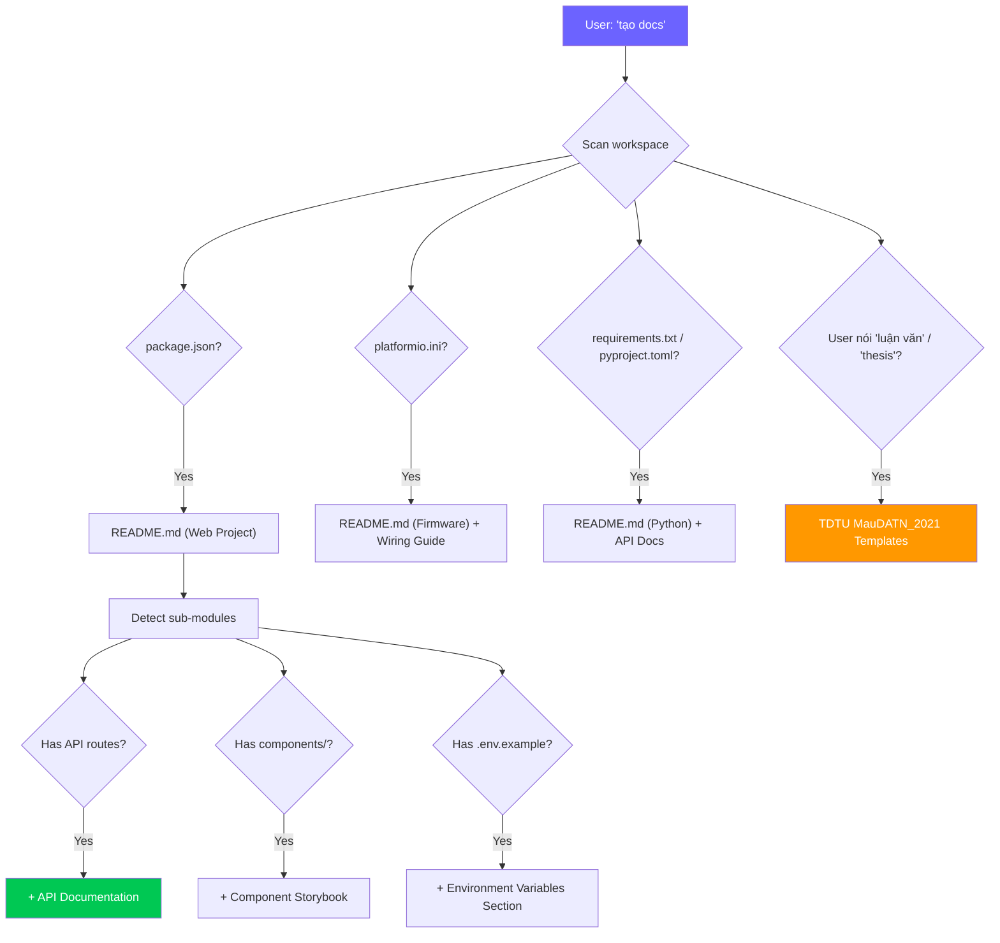

# 📝 Smart Docs Generator Skill — v2.0 Pro Edition

> **Version:** 2.0 Pro · **Updated:** 2026-04-19 · **Category:** Documentation  
> **Changelog v2.0:** TDTU MauDATN_2021 thesis templates, auto-citation generator, Mermaid diagram auto-gen, bilingual support, changelog generator, multi-format output (MD/HTML/PDF suggestion), cross-skill integration.

---

## 1. Mục tiêu (Objective)
Tự động sinh **documentation chất lượng cao** từ code có sẵn — bao gồm README, inline comments, API docs, changelogs, và đặc biệt là **documentation phục vụ báo cáo luận văn TDTU** theo chuẩn MauDATN_2021.

**Triết lý:** *"Good code explains itself. Great documentation teaches others."*

**Cross-skill Integration:**
- **Architecture Planner** blueprint → Auto-gen system architecture docs
- **Code Review** findings → Auto-gen technical debt documentation
- **Snippet Factory** templates → Auto-include JSDoc/docstring
- **Debug Detective** lessons → Auto-gen known issues / troubleshooting guide

---

## 2. Trigger — Khi nào kích hoạt

| Trigger | Priority | Ví dụ |
|---|---|---|
| Yêu cầu viết docs trực tiếp | 🟢 Direct | *"viết README"*, *"tạo docs"* |
| Yêu cầu comment code | 🟢 Direct | *"thêm comment"*, *"giải thích code"* |
| Trước khi submit báo cáo | 🟢 Direct | *"viết cho luận văn"*, *"mô tả hệ thống"* |
| Từ khóa | 🟢 Direct | *"docs:", "readme:", "explain:", "mô tả:"* |
| Sau khi hoàn thành feature | 🔵 Suggest | Tự gợi ý cập nhật README |
| Snippet generated | 🔵 Auto | Auto-add JSDoc vào snippet output |

---

## 3. Auto-Detection — Tự nhận diện cần doc gì



---

## 4. Documentation Templates

### 4.1 — 📄 README.md Generator (Pro Version)

```markdown
<div align="center">

# {{emoji}} {{Project Name}}

> {{Tagline — one compelling sentence}}

[]()
[]()
[]()

[Features](#-features) · [Quick Start](#-quick-start) · [Documentation](#-documentation) · [Contributing](#-contributing)

</div>

---

## ✨ Features

| Feature | Description |
|---|---|
| 🎯 **{{Feature 1}}** | {{Brief description}} |
| ⚡ **{{Feature 2}}** | {{Brief description}} |
| 🔒 **{{Feature 3}}** | {{Brief description}} |
| 📱 **{{Feature 4}}** | {{Brief description}} |

## 📸 Screenshots

<!-- Auto-generated from screenshots/ directory or user-provided -->
| Desktop | Mobile |
|---|---|
|  |  |

## 🚀 Quick Start

### Prerequisites
{{Auto-detect from package.json/requirements.txt}}

```bash
# Verify prerequisites
node --version  # >= {{version}}
npm --version   # >= {{version}}
```

### Installation
```bash
# Clone the repository
git clone https://github.com/{{user}}/{{repo}}.git
cd {{repo}}

# Install dependencies
npm install

# Configure environment
cp .env.example .env
# Edit .env with your settings (see Environment Variables below)

# Start development server
npm run dev
```

### Environment Variables

| Variable | Required | Default | Description |
|---|---|---|---|
| `VITE_API_URL` | No | `http://localhost:3000` | Backend API base URL |
| `VITE_APP_TITLE` | No | `"{{App Name}}"` | Application title |
{{Auto-detect from .env.example}}

## 📁 Project Structure
```
{{Auto-generated file tree with descriptions}}
```

## 🛠️ Tech Stack

| Layer | Technology | Purpose |
|---|---|---|
| Frontend | {{auto}} | UI framework |
| Styling | {{auto}} | Design system |
| State | {{auto}} | State management |
| Build | {{auto}} | Build tool |
| Testing | {{auto}} | Test framework |
| CI/CD | {{auto}} | Automation |

## 📋 Available Scripts

| Script | Description |
|---|---|
| `npm run dev` | Start development server with HMR |
| `npm run build` | Build optimized production bundle |
| `npm run preview` | Preview production build locally |
| `npm run lint` | Run ESLint for code quality |
| `npm run test` | Run test suite |
{{Auto-detect from package.json scripts}}

## 📖 Documentation

- [Architecture Overview](docs/architecture.md)
- [API Reference](docs/api-reference.md)
- [Contributing Guide](CONTRIBUTING.md)
- [Changelog](CHANGELOG.md)

## 🤝 Contributing

1. Fork the project
2. Create your feature branch (`git checkout -b feature/AmazingFeature`)
3. Commit your changes (`git commit -m 'feat: add amazing feature'`)
4. Push to the branch (`git push origin feature/AmazingFeature`)
5. Open a Pull Request

## 📄 License

Distributed under the {{LICENSE}} License. See `LICENSE` for more information.

## 👤 Author

**{{Author Name}}**
- GitHub: [@{{github_username}}](https://github.com/{{github_username}})
- Email: {{email}}

---

<div align="center">
  Made with ❤️ by {{Author}}
</div>
```

### 4.2 — 💬 Inline Comments Generator

#### Commenting Rules:

```
HIERARCHY:
  Level 1 — File header: what this file does, key exports, dependencies
  Level 2 — Section dividers: group related code blocks
  Level 3 — Function/method docs: JSDoc/docstring with params + returns + example
  Level 4 — Logic comments: explain WHY (rationale), not WHAT (obvious)

GOLDEN RULES:
  ✅ DO: Explain WHY a non-obvious decision was made
  ✅ DO: Document complex algorithms step by step
  ✅ DO: Add @example for utility functions
  ✅ DO: Note edge cases and limitations
  ❌ DON'T: Comment obvious code (i++ // increment i)
  ❌ DON'T: Leave TODO/FIXME without owner and deadline
  ❌ DON'T: Write essays — be concise
```

#### JSDoc Template (TypeScript/JavaScript):
```typescript
/**
 * Calculate monthly spending summary grouped by category.
 *
 * Aggregates expense transactions for a specific month/year,
 * grouping totals by category. Income transactions are excluded.
 *
 * @param transactions - All user transactions (both income and expense)
 * @param month - Target month (1-12, NOT 0-indexed)
 * @param year - Target year (e.g., 2026)
 * @returns Record mapping category IDs to total spending (in VND)
 *
 * @example
 * ```ts
 * const summary = getMonthlySummary(allTransactions, 4, 2026);
 * // { "food": 2_500_000, "transport": 800_000, "entertainment": 1_200_000 }
 * ```
 *
 * @throws {RangeError} If month is not between 1 and 12
 * @since 1.0.0
 */
function getMonthlySummary(
  transactions: Transaction[],
  month: number,
  year: number
): Record<string, number> {
  if (month < 1 || month > 12) {
    throw new RangeError(`Month must be 1-12, got ${month}`);
  }

  // Only analyze expense transactions for the target month
  // (income transactions don't contribute to spending analysis)
  return transactions
    .filter(t =>
      t.type === 'expense' &&
      t.date.getMonth() + 1 === month &&   // getMonth() is 0-indexed
      t.date.getFullYear() === year
    )
    .reduce((acc, t) => {
      // Accumulate by category, safe for first occurrence
      acc[t.categoryId] = (acc[t.categoryId] ?? 0) + t.amount;
      return acc;
    }, {} as Record<string, number>);
}
```

#### Python Docstring Template:
```python
def get_monthly_summary(
    transactions: list[Transaction],
    month: int,
    year: int,
) -> dict[str, float]:
    """Calculate monthly spending summary grouped by category.

    Aggregates expense transactions for a specific month/year,
    grouping totals by category. Income transactions are excluded.

    Args:
        transactions: All user transactions (both income and expense).
        month: Target month (1-12).
        year: Target year (e.g., 2026).

    Returns:
        Dictionary mapping category IDs to total spending in VND.

    Raises:
        ValueError: If month is not between 1 and 12.

    Example:
        >>> summary = get_monthly_summary(all_transactions, 4, 2026)
        >>> summary
        {'food': 2500000, 'transport': 800000}
    """
```

### 4.3 — 📊 API Documentation Generator

```markdown
# 📊 API Reference — {{API Name}}

**Base URL:** `{{BASE_URL}}`  
**Version:** {{VERSION}}  
**Authentication:** {{Bearer Token / API Key / None}}

---

## Endpoints Overview

| Method | Endpoint | Description | Auth |
|---|---|---|---|
| `GET` | `/api/items` | List all items | ✅ |
| `POST` | `/api/items` | Create new item | ✅ |
| `GET` | `/api/items/:id` | Get single item | ✅ |
| `PUT` | `/api/items/:id` | Update item | ✅ |
| `DELETE` | `/api/items/:id` | Delete item | ✅ |

---

## Detailed Endpoints

### `GET /api/items`

List all items with optional filtering and pagination.

**Query Parameters:**

| Parameter | Type | Required | Default | Description |
|---|---|---|---|---|
| `limit` | integer | No | 50 | Max results per page (1-100) |
| `offset` | integer | No | 0 | Pagination offset |
| `sort` | string | No | `created_at` | Sort field |
| `order` | string | No | `desc` | Sort order: `asc` \| `desc` |
| `search` | string | No | - | Full-text search query |

**Response:** `200 OK`
```json
{
  "data": [
    {
      "id": "abc123",
      "name": "Example Item",
      "description": "An example",
      "created_at": "2026-04-19T12:30:00Z",
      "updated_at": "2026-04-19T14:00:00Z"
    }
  ],
  "pagination": {
    "total": 142,
    "limit": 50,
    "offset": 0,
    "has_more": true
  }
}
```

**Error Responses:**

| Status | Code | Description |
|---|---|---|
| `400` | `INVALID_PARAMETERS` | Invalid query parameters |
| `401` | `UNAUTHORIZED` | Missing or invalid auth token |
| `500` | `INTERNAL_ERROR` | Internal server error |

**Example:**
```bash
curl -X GET "{{BASE_URL}}/api/items?limit=10&sort=name&order=asc" \
  -H "Authorization: Bearer YOUR_TOKEN"
```
```

### 4.4 — 📝 Changelog Generator

```markdown
# Changelog

All notable changes to this project will be documented in this file.

Format follows [Keep a Changelog](https://keepachangelog.com/en/1.1.0/),
and this project adheres to [Semantic Versioning](https://semver.org/).

## [Unreleased]
### Added
- {{New feature from latest commits}}

### Changed
- {{Modified feature from latest commits}}

### Fixed
- {{Bug fix from latest commits}}

---

## [{{VERSION}}] — {{DATE}}

### Added
- 🎉 Initial release
- ✨ {{Feature 1 — auto-detect from git log}}
- ✨ {{Feature 2}}

### Changed
- ♻️ {{Change 1 — from git log conventional commits}}

### Fixed
- 🐛 {{Bug fix 1 — from git log}}

### Security
- 🔒 {{Security fix if any}}
```

**Auto-generation rules:**
- Parse git log với [Conventional Commits](https://www.conventionalcommits.org/)
- `feat:` → Added, `fix:` → Fixed, `refactor:` → Changed, `security:` → Security
- Group by version tag

---

## 5. TDTU Thesis Documentation — MauDATN_2021

### 5.1 — Chương 1: Tổng quan
```markdown
## CHƯƠNG 1: TỔNG QUAN

### 1.1. Giới thiệu
[Giới thiệu chung về đề tài, lý do chọn đề tài, tính cấp thiết]

### 1.2. Mục tiêu nghiên cứu
#### 1.2.1. Mục tiêu tổng quát
[Mục tiêu lớn của đề tài]

#### 1.2.2. Mục tiêu cụ thể
- Mục tiêu 1: [...]
- Mục tiêu 2: [...]
- Mục tiêu 3: [...]

### 1.3. Đối tượng và phạm vi nghiên cứu
#### 1.3.1. Đối tượng nghiên cứu
[Đối tượng cụ thể]

#### 1.3.2. Phạm vi nghiên cứu
[Giới hạn về thời gian, không gian, nội dung]

### 1.4. Phương pháp nghiên cứu
- Phương pháp nghiên cứu lý thuyết: [...]
- Phương pháp thực nghiệm: [...]
- Phương pháp đánh giá: [...]

### 1.5. Bố cục luận văn
Luận văn gồm {{N}} chương:
- **Chương 1:** Tổng quan — Giới thiệu đề tài, mục tiêu, phạm vi nghiên cứu.
- **Chương 2:** Cơ sở lý thuyết — Trình bày các lý thuyết và công nghệ liên quan.
- **Chương 3:** Thiết kế hệ thống — Mô tả kiến trúc, thiết kế chi tiết.
- **Chương 4:** Kết quả thực nghiệm — Trình bày kết quả và đánh giá.
- **Chương 5:** Kết luận và hướng phát triển.
```

### 5.2 — Chương 3: Thiết kế hệ thống (Auto-gen từ code)
```markdown
## CHƯƠNG 3: THIẾT KẾ HỆ THỐNG

### 3.1. Tổng quan hệ thống
[Auto-gen: đọc Architecture Planner blueprint → sinh mô tả]

**Hình 3.1:** Sơ đồ kiến trúc tổng thể hệ thống
[Auto-gen: Mermaid diagram từ component hierarchy]

### 3.2. Thiết kế phần cứng (nếu có IoT/Embedded)
#### 3.2.1. Sơ đồ khối
[Auto-gen từ config.h pin definitions → block diagram]

#### 3.2.2. Sơ đồ nguyên lý
**Bảng 3.1:** Bảng kết nối chân vi điều khiển ESP32-S3

| STT | Chức năng | GPIO | Ghi chú |
|-----|-----------|------|---------|
{{Auto-gen từ config.h #define PIN_xxx}}

#### 3.2.3. Mô tả cảm biến và thiết bị ngoại vi
[Auto-gen từ lib_deps trong platformio.ini]

### 3.3. Thiết kế phần mềm
#### 3.3.1. Sơ đồ use case
```mermaid
{{Auto-gen từ API routes hoặc user stories}}
```

#### 3.3.2. Sơ đồ hoạt động
```mermaid
{{Auto-gen từ main logic flow}}
```

#### 3.3.3. Thiết kế cơ sở dữ liệu
**Hình 3.X:** Sơ đồ quan hệ thực thể (ERD)
```mermaid
{{Auto-gen từ data models / TypeScript interfaces}}
```

**Bảng 3.X:** Mô tả chi tiết bảng {{TableName}}

| STT | Tên trường | Kiểu dữ liệu | Ràng buộc | Mô tả |
|-----|-----------|---------------|-----------|-------|
{{Auto-gen từ interface fields}}

### 3.4. Thiết kế giao diện
#### 3.4.1. Wireframe
[Mô tả layout các màn hình chính]

#### 3.4.2. Giao diện người dùng
[Screenshots hoặc mockups]

### 3.5. Mô tả thuật toán chính
#### 3.5.1. Thuật toán {{Name}}

**Mục đích:** [Auto-gen từ function JSDoc]

**Đầu vào:** [Auto-gen từ parameters]
**Đầu ra:** [Auto-gen từ return type]

**Lưu đồ:**
```mermaid
{{Auto-gen flowchart từ function logic}}
```

**Mã giả (Pseudocode):**
```
{{Auto-simplify code → pseudocode}}
```

**Độ phức tạp:**
- Thời gian: O({{auto-analyze}})
- Không gian: O({{auto-analyze}})
```

### 5.3 — Chương 4: Kết quả thực nghiệm
```markdown
## CHƯƠNG 4: KẾT QUẢ THỰC NGHIỆM

### 4.1. Môi trường thực nghiệm

**Bảng 4.1:** Cấu hình môi trường phát triển

| Thành phần | Chi tiết |
|---|---|
| Hệ điều hành | {{auto: OS}} |
| Ngôn ngữ lập trình | {{auto: từ package.json/platformio.ini}} |
| Framework | {{auto}} |
| IDE | {{auto: VSCode}} |
| Phiên bản | {{auto: node/python/arduino version}} |
| Vi điều khiển (nếu có) | {{auto: từ platformio.ini board}} |

### 4.2. Kết quả đạt được
#### 4.2.1. Chức năng {{Feature 1}}
**Mô tả:** [Chức năng làm gì]
**Kết quả:** [Screenshot hoặc output]
**Đánh giá:** [Đạt/Chưa đạt yêu cầu]

### 4.3. Đánh giá và thảo luận

**Bảng 4.X:** So sánh kết quả với yêu cầu đề ra

| STT | Yêu cầu | Kết quả | Đánh giá |
|-----|---------|---------|----------|
| 1 | {{Requirement 1}} | {{Result}} | ✅ Đạt / ❌ Chưa đạt |
```

### 5.4 — Tài liệu tham khảo (Auto-citation)
```markdown
## TÀI LIỆU THAM KHẢO

### Tiếng Việt
[1] {{Author}}, "{{Title}}," {{Publisher}}, {{Year}}.

### Tiếng Anh
[2] {{Author}}, "{{Title}}," in *{{Journal/Conference}}*, vol. {{X}}, no. {{Y}}, pp. {{A-B}}, {{Year}}.
[3] {{Author}}, *{{Book Title}}*, {{Edition}} ed. {{City}}: {{Publisher}}, {{Year}}.

### Website / Online
[4] {{Author/Org}} ({{Year}}). {{Title}}. [Online]. Available: {{URL}}. [Accessed: {{Date}}].

### API / Library Documentation
[5] {{Library Name}} v{{Version}} Documentation. [Online]. Available: {{URL}}.
```

**Auto-citation rules:**
- Scan `package.json` dependencies → generate library citations
- Scan code comments with URLs → generate web citations
- Format theo chuẩn IEEE (phổ biến cho CNTT tại TDTU)

---

## 6. Mermaid Diagram Auto-Generator

Khi scan code, tự sinh các diagrams phù hợp:

| Source | Diagram Type | Mermaid Type |
|---|---|---|
| Component imports | Component Hierarchy | `graph TD` |
| TypeScript interfaces | ER Diagram | `erDiagram` |
| API routes | Sequence Diagram | `sequenceDiagram` |
| State machine logic | State Diagram | `stateDiagram-v2` |
| Function flow | Flowchart | `flowchart TD` |
| Git history | Timeline | `gitgraph` |
| Task dependencies | Gantt Chart | `gantt` |

---

## 7. Quality Rules — Quy tắc chất lượng

1. **Không viết comment thừa:** `i++; // increment i` → XÓA
2. **Luôn cập nhật:** Code thay đổi → docs phải thay đổi. Docs cũ = docs sai.
3. **Có ví dụ cụ thể:** Mỗi function doc phải có `@example` với giá trị thực tế.
4. **Đúng format chuẩn:** JSDoc cho JS/TS, docstring cho Python, Doxygen cho C/C++.
5. **README phải test:** Mọi command trong README phải copy-paste chạy được.
6. **Bilingual:** Tiếng Việt cho nội dung, tiếng Anh cho technical terms.
7. **Accessible:** Sử dụng heading hierarchy đúng (h1 > h2 > h3), có table of contents.

---

## 8. Output Format

```markdown
## 📝 Documentation Generated

| Metadata | Value |
|---|---|
| **Type** | [README / API Docs / Comments / Thesis / Changelog] |
| **Format** | [Markdown / JSDoc / Python docstring] |
| **Coverage** | [X functions / Y components documented] |
| **Files affected** | [list of files] |

[GENERATED DOCUMENTATION]

---
### 💡 Enhancement Suggestions:
1. [Add screenshots for UI documentation]
2. [Add deployment guide section]
3. [Generate Mermaid diagrams for architecture]

### 📤 Export Options:
- `docs:` prefix for inline docs
- Copy markdown → paste into Google Docs for thesis formatting
- Suggest: `npx md-to-pdf README.md` for PDF export
```

---

## 9. Adaptive Behavior

| Context | Behavior |
|---|---|
| Web project (React/Vue) | Focus on component docs, props tables, usage examples |
| API project (Express/FastAPI) | Focus on endpoint docs, request/response examples |
| Firmware (ESP32) | Focus on pin diagrams, wiring guide, flash instructions |
| Python script | Focus on CLI usage, module docstrings |
| User mentions "luận văn" | Switch to TDTU MauDATN_2021 template |
| User mentions "README" | Generate full README with badges, screenshots section |
| Existing docs found | Update instead of replace, preserve existing content |
| Git history available | Auto-gen changelog from conventional commits |
